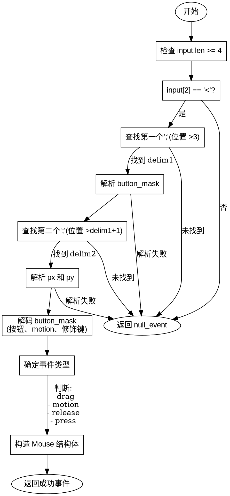

嗯，我需要为这个Zig函数`parseMouse`生成一个流程图。首先，我得仔细阅读代码，理解每个步骤的逻辑流程。这个函数的作用是解析鼠标事件输入，对吧？

首先，函数开始时会检查输入的长度是否至少为4个字节，因为输入应该以ESC序列开头，比如ESC [ < [Mm]。如果输入长度不够，断言会失败。不过这里的断言是调试用的，可能不影响流程图。

接下来，函数定义了一个`null_event`结果，如果后续解析失败，就返回这个。然后检查输入的第3个字符（索引2，因为Zig是从0开始计数）是否是'<'，如果不是，直接返回null_event。

然后，代码尝试找到第一个分号';'的位置，从输入的第3个位置开始找。如果找不到，返回null_event。找到后，解析按钮掩码(button_mask)，接着找第二个分号，同样处理。之后解析px和py坐标。

接下来，处理按钮掩码，分解出按钮、移动(motion)、shift、alt、ctrl等状态。然后构造Mouse结构体，根据不同的条件判断事件类型：拖动(drag)、移动(motion)、释放(release)或按下(press)。

在画流程图的时候，需要把这些判断和步骤都表示出来。比如，每个条件检查都是一个菱形判断框，步骤是矩形框，结束点是椭圆形。需要注意流程的分支，比如在检查input[2]是否为'<'时，如果否，直接返回null_event；同样在寻找分号时，如果找不到，也返回。解析参数失败也是如此。

还有，处理按钮掩码时，各个位的检查，以及最后确定事件类型时的多个条件判断。特别是那个blk块的类型判断，需要分解成不同的条件分支。

可能容易出错的地方是遗漏某些条件分支，或者在流程图中错误地连接箭头。比如，在解析button_mask、px、py时，如果有任何一个步骤失败（返回null），都应该立即返回null_event。这些步骤需要用判断框来表示可能的失败路径。

另外，函数的返回部分有两个可能的结果：成功返回带有mouse事件的结构，或者中途失败返回null_event。需要确保所有路径最终都指向正确的返回点。

可能需要将整个过程分解为以下步骤：

1. 开始
2. 检查输入长度 >=4
3. 检查input[2]是否为'<'
   - 否 → 返回null_event
   - 是 → 继续
4. 寻找第一个分号(delim1)
   - 找不到 → 返回null_event
   - 找到 → 解析button_mask
5. 寻找第二个分号(delim2)
   - 找不到 → 返回null_event
   - 找到 → 解析px和py
6. 解析button_mask的各部分（按钮、modifiers、motion）
7. 确定事件类型（drag、motion、release、press）
8. 构造Mouse结构体
9. 返回成功结果

每个步骤中的错误处理都需要对应到返回null_event的路径。在画图时，要确保每个可能的错误情况都有对应的判断和流程。

另外，需要注意各个变量的解析顺序和依赖关系，比如delim1在找到后，才能解析button_mask，然后找到delim2，再解析px和py。这部分顺序不能颠倒。

最后的类型判断部分有多个条件，可能需要多个判断框来依次检查每个条件，并确定事件类型。

总之，流程图需要清晰地展示每个条件判断、解析步骤以及可能的错误处理路径，确保所有逻辑分支都被覆盖，没有遗漏。
================================================
以下是使用Graphviz绘制的函数`parseMouse`的流程图：

流程图说明：
1. 入口首先验证输入长度
2. 分三级校验（字符'<'、两个分号的存在性）
3. 参数解析失败均跳转到错误出口
4. 解码阶段包含位掩码分解和事件类型决策树
5. 最终成功路径会构造完整鼠标事件结构体
6. 所有错误路径统一收敛到null_event返回点

可以使用Graphviz工具（如VSCode的Graphviz插件或在线编辑器）渲染此代码生成矢量流程图。关键路径用绿色高亮表示，错误路径用红色虚线表示（需添加样式属性）。