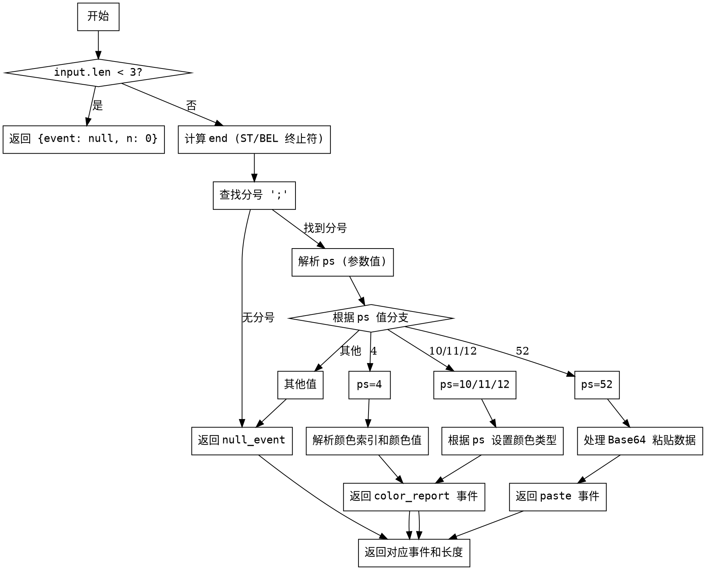

嗯，我需要为这个Zig函数画一个流程图。首先，我得仔细看看这个函数的结构。函数的名字是parseOsc，输入参数是一个u8的切片和一个可选的分配器。返回的是一个Result类型。

函数一开始检查输入的长度是否小于3，如果是的话，直接返回一个空的event和n=0。这部分应该是流程图的第一个判断框。

接下来，有一个变量bel_terminated初始化为false。然后定义了一个end的常量，这里用了blk块来处理。这里调用了skipUntilST函数，如果结果n大于0，就break到blk，把end设为esc_result.n。否则，寻找BEL字符（0x07），如果找到的话，bel_terminated设为true，end设为找到的位置+1。如果找不到BEL，就返回null_event。这部分需要分几个步骤，可能是一个循环或者条件判断。

然后，sequence被定义为输入的前end个字节。接着检查是否有分号，如果没有的话返回null_event。如果有，解析ps的值，根据不同的ps值进入不同的case。

比如，当ps是4的时候，需要找第二个分号，解析ps_idx，然后处理颜色规格。如果是10、11、12的话，处理不同的颜色类型。ps为52的情况处理粘贴数据，进行base64解码。其他情况返回null_event。

每个case里面可能还有条件判断，比如检查分号的位置，解析数字，处理颜色规格，是否bel_terminated影响切片的位置等等。

需要把这些条件分支都画出来，可能流程会比较复杂。比如开始检查input.len <3，然后处理end的获取，然后处理semicolon_idx是否存在，接着根据ps的不同值分支，每个分支内部又有不同的步骤，比如解析颜色、处理base64等。

需要注意各个条件之间的连接，比如如果某个步骤失败就返回null_event，成功的话继续处理。可能需要使用菱形判断框来表示条件分支，矩形框表示处理步骤，终止点返回结果。

可能的结构是：

开始 -> 输入长度是否<3？是的话返回n=0。

否则，进入处理end的部分，分为两种情况：找到ST还是BEL。

然后检查是否有分号，没有的话返回null。

接着根据ps的值分多个分支，每个分支内部处理不同的逻辑，最后返回相应的event和n。

对于ps=52的情况，还需要检查是否有'c'，然后解码base64，分配内存等。

需要注意错误处理，比如parseUnsigned可能会失败，这时候也返回null_event。

可能用流程图中的不同路径来表示这些情况，确保每个可能的执行路径都被覆盖。

总的来说，流程图的结构应该是从顶到底，根据不同的条件分支展开，每个分支处理不同的逻辑，直到返回结果。
================================================
使用 Graphviz 的 DOT 语言绘制流程图如下：

流程图说明：
1. **入口**检查输入长度，若小于 3 则直接返回空事件。
2. 计算终止符位置（`end`），分为 ST 转义序列或 BEL 终止符两种情况。
3. 查找分号 `;`，若不存在则返回空事件。
4. 解析参数 `ps` 的值，根据不同的 `ps` 值进入不同分支：
   - **ps=4**：处理带索引的颜色报告。
   - **ps=10/11/12**：处理前景/背景/光标颜色。
   - **ps=52**：解码 Base64 粘贴数据。
   - 其他值直接返回空事件。
5. 每个分支最终构造对应事件并返回结果。