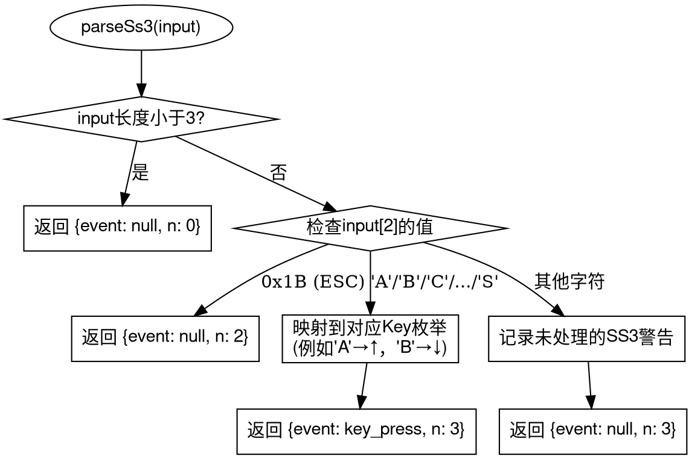

嗯，用户让我用Graphviz来画一个Zig函数的流程图。首先，我需要理解这个函数的结构。函数是parseSs3，输入是一个u8的切片，返回一个Result结构体。函数开始检查输入的长度是否小于3，如果是，返回n为0，事件为空。否则，根据input[2]的值进行不同的处理。如果input[2]是0x1B，就返回n为2。否则，根据不同的字符对应不同的Key值，比如'A'对应上箭头等。如果都不是，记录警告并返回n为3。最后，如果匹配到了有效的Key，返回事件为key_press，n为3。

接下来，我需要把这些逻辑转化为流程图。流程图通常包括开始、判断、处理步骤和结束节点。首先，开始节点是函数入口。然后第一个判断是输入长度是否小于3。如果是，直接返回n=0。否则，进入下一个判断，检查input[2]的值。这里可能需要多个分支：0x1B的情况，各个字符对应的Key，以及默认情况。每个分支处理完后，会有不同的返回路径。

需要注意的是，每个条件判断后的处理步骤，比如返回不同的n值和事件。特别是当input[2]是0x1B时，直接返回n=2，而其他字符可能返回n=3或者在默认情况下也返回n=3但记录警告。最后，如果匹配到有效的Key，构造key_press事件并返回。

我需要确保流程图的节点和箭头正确反映这些逻辑分支。可能的结构是：

1. 开始
2. 判断input.len <3 → 是→返回n=0
3. 否则→判断input[2]的值：
   a. 0x1B →返回n=2
   b. 'A'-'S'等→设置对应的codepoint→返回n=3和事件
   c. 其他→记录警告→返回n=3
   
需要确保所有分支都被覆盖，特别是switch中的各个case和default情况。另外，返回时的结构是否有事件取决于分支，比如在0x1B和默认情况下事件是null，而在有效字符时有key_press。

现在用Graphviz的DOT语言来表示这些节点和边。节点用形状区分，比如菱形表示判断，矩形表示处理步骤，椭圆形表示开始/结束。边上的标签注明条件或操作。

可能的结构如下：

digraph {
    start [label="parseSs3(input)" shape=ellipse]
    check_len [label="input.len < 3?" shape=diamond]
    return0 [label="返回 {event: null, n: 0}" shape=rectangle]
    check_char [label="input[2] 的值" shape=diamond]
    return2 [label="返回 {event: null, n: 2}" shape=rectangle]
    handle_key [label="设置对应Key的codepoint" shape=rectangle]
    warn [label="记录警告" shape=rectangle]
    return3 [label="返回 {event: key_press, n: 3}" shape=rectangle]
    return3_null [label="返回 {event: null, n: 3}" shape=rectangle]

    start -> check_len
    check_len -> return0 [label="是"]
    check_len -> check_char [label="否"]
    check_char -> return2 [label="0x1B"]
    check_char -> handle_key [label="'A','B',...,'S'"]
    check_char -> warn [label="其他"]
    handle_key -> return3
    warn -> return3_null
}

这样应该能覆盖所有情况。需要注意每个条件的分支是否正确，以及返回值的结构是否准确。特别是return3和return3_null的区别，是否有事件。根据代码，当匹配到字符时，返回event是key_press，而默认情况返回null，所以需要分开两个返回节点。
================================================

该流程图使用Graphviz绘制，完整呈现以下逻辑：
1. 入口检查输入长度，不足3直接返回
2. 对第3字节进行多路分支：
   - 0x1B直接返回n=2
   - 有效字符映射到Key枚举
   - 未知字符记录警告
3. 最终返回不同结构的Result，区分有效按键和无效情况

节点说明：
- 椭圆形：函数入口
- 菱形：条件判断
- 矩形：具体操作/返回结果
- 箭头标签明确标注判断条件或操作类型