好的，我需要帮用户把提供的Zig函数`prettyPrint`转换成Graphviz的流程图。首先，我要仔细理解这个函数的结构和逻辑。

首先，函数开始检查是否处于主屏幕，如果不是则返回错误。然后向终端写入隐藏光标和同步设置的指令，使用`defer`来确保在函数结束时恢复同步状态和重置SGR属性。

接下来，声明了一些变量，如`reposition`、`row`、`col`等，用于跟踪光标位置和样式。然后进入一个循环，遍历`self.screen.buf`中的每个单元格（cell）。

对于每个单元格，计算字符宽度，处理可能的跳过的单元格。然后检查列是否超过屏幕宽度，如果是则换行，并根据需要设置重新定位标志。如果单元格是默认样式，则标记需要重新定位并继续循环。

在处理每个单元格时，会检查是否需要重新定位光标，并通过终端控制序列移动光标。如果单元格包含图像，则输出相应的图像控制序列。

接下来，根据单元格的样式（前景色、背景色、下划线、粗体、斜体等）与当前样式的差异，生成并输出对应的终端控制序列。每个样式属性的变化都会触发相应的控制指令。

最后，处理超链接（URL）的变化，输出相应的OSC8控制序列，并写入字符的图形。更新光标位置，循环结束后输出换行符。

在绘制流程图时，需要将上述步骤分解为不同的节点，并用箭头表示执行顺序。需要注意条件判断（如`if`语句）和循环结构（`while`循环）的分支。例如，检查`self.state.alt_screen`、处理每个单元格的不同情况、样式变化的判断等，都需要相应的决策节点。

可能遇到的挑战是正确处理循环内部的复杂逻辑，包括多个条件判断和`defer`语句。需要确保每个条件分支都有对应的节点，并且流程图的箭头正确反映代码的执行路径。此外，图像处理部分和样式变化的多个判断也需要详细展开，避免遗漏关键步骤。

需要确认Graphviz的语法是否正确，每个节点使用适当的形状（如矩形表示操作，菱形表示判断），并使用正确的箭头连接。确保流程图的层次结构清晰，便于理解函数的执行流程。
================================================

```dot
digraph prettyPrint {
    node [shape=rectangle, fontname="Courier", fontsize=10];
    edge [fontname="Courier", fontsize=10];

    start [label="Start prettyPrint"];
    check_alt_screen [label="Check if in alt screen"];
    error_not_primary [label="Return error.NotInPrimaryScreen", shape=oval];
    write_hide_sync [label="Write hide cursor\nand sync set"];
    defer_sync_reset [label="Defer sync reset"];
    defer_sgr_reset [label="Defer SGR reset"];
    init_vars [label="Initialize variables:\nreposition, row, col,\ncursor, link, cursor_pos"];
    loop_start [label="Loop over screen.buf\ni = 0"];
    check_i [label="i < screen.buf.len?"];
    process_cell [label="Process cell[i]"];
    calc_width [label="Calculate character width (w)"];
    defer_advance [label="Defer: Mark skipped cells\nAdvance col and i"];
    check_col_overflow [label="col >= screen.width?"];
    increment_row [label="row += 1\ncol = 0\nSet reposition"];
    check_default_style [label="cell.default?"];
    set_reposition [label="Set reposition = true"];
    update_cursor_style [label="Update cursor and link styles"];
    check_reposition [label="Need reposition?"];
    handle_reposition [label="Reposition cursor\nvia control sequences"];
    check_image [label="cell.image exists?"];
    write_image [label="Write image control sequences"];
    check_style_changes [label="Check style changes:\nfg, bg, ul, bold, etc."];
    write_style_controls [label="Write corresponding\ncontrol sequences"];
    check_url_change [label="URL changed?"];
    write_url [label="Write OSC8 control sequence"];
    write_grapheme [label="Write grapheme to tty"];
    update_cursor_pos [label="Update cursor_pos"];
    increment_i [label="i += w"];
    loop_end [label="End loop"];
    write_final_newline [label="Write \\r\\n"];
    end [label="End"];

    start -> check_alt_screen;
    check_alt_screen -> error_not_primary [label="Yes"];
    check_alt_screen -> write_hide_sync [label="No"];
    write_hide_sync -> defer_sync_reset;
    defer_sync_reset -> defer_sgr_reset;
    defer_sgr_reset -> init_vars;
    init_vars -> loop_start;
    loop_start -> check_i;
    check_i -> process_cell [label="Yes"];
    check_i -> write_final_newline [label="No"];
    process_cell -> calc_width;
    calc_width -> defer_advance;
    defer_advance -> check_col_overflow;
    check_col_overflow -> increment_row [label="Yes"];
    check_col_overflow -> check_default_style [label="No"];
    increment_row -> check_default_style;
    check_default_style -> set_reposition [label="Yes"];
    check_default_style -> update_cursor_style [label="No"];
    set_reposition -> update_cursor_style;
    update_cursor_style -> check_reposition;
    check_reposition -> handle_reposition [label="Yes"];
    handle_reposition -> check_image;
    check_reposition -> check_image [label="No"];
    check_image -> write_image [label="Yes"];
    write_image -> check_style_changes;
    check_image -> check_style_changes [label="No"];
    check_style_changes -> write_style_controls;
    write_style_controls -> check_url_change;
    check_url_change -> write_url [label="Yes"];
    write_url -> write_grapheme;
    check_url_change -> write_grapheme [label="No"];
    write_grapheme -> update_cursor_pos;
    update_cursor_pos -> increment_i;
    increment_i -> loop_start [label="Loop next"];
    write_final_newline -> end;
}
```
