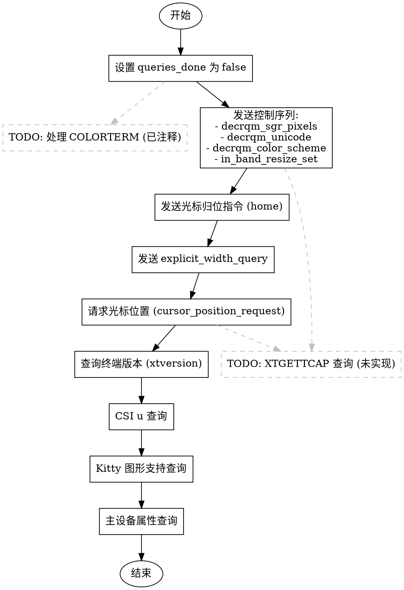

好的，我需要帮用户用Graphviz画出Zig函数queryTerminalSend的流程图。首先，我要仔细阅读代码，理解每个步骤的作用。

函数开始于设置queries_done为false。然后有几个被注释掉的TODO部分，可能暂时不需要处理。接下来是多个try tty.writeAll调用，发送不同的控制序列。这些序列包括decrqm_sgr_pixels、decrqm_unicode等。之后有一系列具体的操作，比如移动光标到home位置，发送explicit_width_query，请求光标位置，查询终端版本，CSI u查询，kitty图形支持和主设备属性。

我需要将这些步骤转化为流程图中的节点。每个writeAll操作可以作为一个步骤，但要注意它们是被连续调用的，可能有顺序。另外，注释中的TODO部分虽然被注释掉了，但可能作为备注加入流程图中。

需要注意Graphviz的语法，用digraph定义图，节点用方框，箭头表示流程方向。确保每个步骤正确连接，没有遗漏关键操作。还要处理错误情况吗？函数返回错误类型，所以每个try都可能引发错误，但用户可能只关注主要流程。需要确认是否包含错误处理分支，但根据用户要求，可能只需主流程。

现在开始组织步骤：

1. 开始节点：设置queries_done为false。
2. 注释掉的COLORTERM处理（作为备注节点）。
3. 发送多个控制序列（合并为一个节点或多个节点？）。
4. 发送home、explicit_width_query等组合。
5. 结束节点。

可能将连续的writeAll合并为一个步骤，但每个控制序列可能代表不同的操作。或者分开每个write的部分，但代码中是一次性写入多个ctlseqs的拼接。因此，在流程图中，可以表示为一个“发送多个控制序列”的步骤，然后接着后续的具体操作步骤。

另外，最后的几个查询步骤需要按顺序排列。例如，发送home，然后发送explicit_width_query，再请求光标位置，等等。

可能需要将每个ctlseqs的写入拆分为单独的节点，但代码中是一次性写入，所以可能需要合并。需要判断用户希望详细还是概括。

最终，流程图的结构大致如下：

开始 -> 设置queries_done -> 发送多个控制序列（包括decrqm等） -> 发送home和后续查询序列 -> 结束。

同时，注释的TODO部分可以作为旁注节点，用虚线连接或者作为注释文本。

确保使用正确的Graphviz语法，如节点名称、箭头，形状等。可能需要使用形状如box，菱形判断等，但此处主要是顺序步骤，所以大部分是矩形节点。

现在编写Graphviz代码，按照上述逻辑组织节点和连接。
================================================
