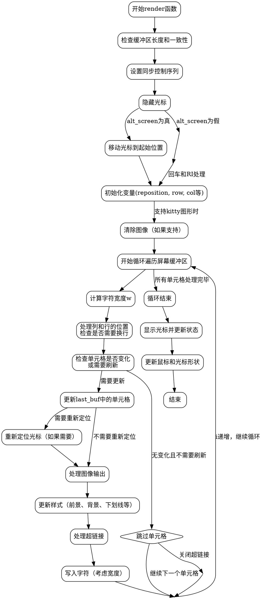

嗯，我需要用Graphviz来画出这个Zig函数的流程图。首先，我得仔细看看这个函数的结构。函数名是render，属于Vaxis结构体的方法。它的主要作用应该是将屏幕内容渲染到终端。

首先，函数开始时有几个assert语句，检查屏幕缓冲区的长度是否正确，以及当前屏幕和上一次屏幕的缓冲区长度是否一致。这部分可能对应流程图中的初始检查步骤。

接下来是设置同步操作，使用tty.writeAll写入控制序列，然后有一个defer语句用于在函数结束时重置同步。这部分可能是一个准备阶段，之后可能会有条件判断。

然后隐藏光标，根据是否处于alt_screen状态，移动光标到不同的位置。这里涉及到条件分支，比如if (self.state.alt_screen)的分支处理，这应该在流程图中体现为两个不同的路径。

之后初始化一些变量，如reposition、row、col、cursor、link、cursor_pos等。这些变量的初始化可能对应流程图的初始化步骤。

接下来是清除所有图像的部分，如果支持kitty图形的话。这又是一个条件判断，可能需要一个判断框。

然后是主循环，遍历屏幕缓冲区的每个单元格。循环内部有很多条件判断，比如单元格是否与上一次相同，是否需要重新定位光标，处理图像、颜色、样式等。这部分是整个函数的核心，需要详细展开。

循环内部的处理包括：
1. 计算字符宽度。
2. 处理光标位置和换行。
3. 比较当前单元格和上一次的单元格，决定是否需要更新。
4. 更新样式（前景色、背景色、下划线等）。
5. 处理超链接和图像。
6. 写入字符到终端。

循环结束后，处理光标的显示和形状，以及鼠标形状的更新。这部分可能对应流程图的结束部分。

在画流程图时，需要将每个主要步骤转换为节点，并用箭头表示流程走向。特别是条件判断部分，如if语句，需要分支出不同的路径。循环结构也需要正确表示，比如使用循环开始和结束的节点。

需要注意的地方：
- defer语句的执行时机，可能需要在适当的位置标注。
- 主循环中的多个条件判断，可能会增加流程图的复杂性，需要合理组织结构，避免交叉过多。
- 每个样式属性的更新（如前景色、背景色）可能有相似的结构，可以合并表示，或者用子流程来简化。

可能的节点包括：
- 初始化和检查
- 同步设置
- 光标隐藏和定位
- 变量初始化
- 清除图像
- 主循环开始
  - 计算宽度
  - 处理光标位置
  - 检查单元格变化
  - 更新样式
  - 处理图像和链接
  - 写入字符
- 循环结束
- 显示光标和更新形状

最后，确保所有可能的路径都被覆盖，尤其是条件分支和循环中的continue或break情况。例如，在单元格未变化时跳过更新，继续下一个循环迭代。
================================================


该流程图使用Graphviz DOT语言表示，主要特点包括：

1. 使用分层结构展示从函数开始到结束的整体流程
2. 详细展示了主循环处理单元格的核心逻辑
3. 用菱形节点表示条件判断（如alt_screen状态、单元格变化检查）
4. 包含隐式控制流节点（小圆点）处理复杂分支
5. 涵盖所有关键步骤：同步设置、光标控制、样式更新、图像处理等
6. 使用箭头标签说明重要分支条件
7. 保持模块化设计，将样式更新等复杂操作合并为单个节点

可以通过Graphviz工具（如dot命令）渲染为PNG/SVG等格式：
```bash
dot -Tpng flowchart.dot -o render_flow.png
```