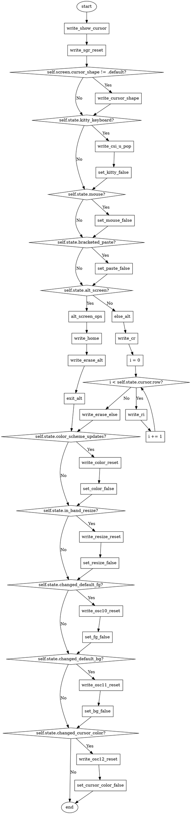

好的，我需要帮用户用Graphviz画出这个Zig函数的流程图。首先，我得仔细看看这个函数的代码结构。函数是resetState，接收self和tty参数，返回错误联合类型。

函数开始先写了一些控制序列到tty，比如显示光标和重置SGR。然后是一系列的if条件判断，每个条件对应不同的状态重置操作，比如kitty键盘模式、鼠标模式、括号粘贴模式等。最后处理颜色方案、默认前景色、背景色、光标颜色等的重置。

接下来，我需要将这些步骤转化为流程图。流程图通常从开始节点开始，然后是各个处理步骤，根据条件判断分支，最后结束。

首先，开始节点，然后执行tty.writeAll(show_cursor)和sgr_reset，这两个应该是顺序执行，没有条件。接着检查self.screen.cursor_shape是否为default，如果不是，就执行cursor_shape的设置。这部分是一个条件分支。

之后是一连串的if条件，每个条件对应不同的操作。比如检查kitty_keyboard是否为true，如果是，执行写入csi_u_pop并设置状态为false。同样的情况适用于mouse、bracketed_paste、alt_screen等。这里每个条件都是独立的，没有嵌套，所以应该按顺序处理每个条件判断，每个条件后面跟着相应的操作。

处理alt_screen的时候，如果进入if分支，会执行home、erase_below_cursor，然后exitAltScreen。否则，在else分支里，写回车，然后循环写入ri，再erase_below_cursor。这里需要处理条件分支，并在每个分支里画出对应的操作步骤，特别是循环部分。

接下来的其他条件判断，如color_scheme_updates、in_band_resize、changed_default_fg等，每个都是单独的检查，执行相应的重置操作，并更新状态变量。这些都可以用条件节点表示，每个条件后接对应的操作。

最后，所有条件处理完毕，流程结束。

需要注意的是，Graphviz使用DOT语言，节点用形状表示，条件判断通常用菱形，操作用矩形，开始和结束用椭圆形。流程图的箭头表示执行顺序。

现在，我需要将上述逻辑转化为DOT语法。每个步骤对应一个节点，条件判断分支到不同的路径。比如：

开始 -> 显示光标和SGR重置 -> 检查cursor_shape -> 如果不是default，设置cursor shape -> 检查kitty_keyboard -> 如果true，执行相应操作 -> 检查mouse -> 依此类推。

对于alt_screen的else分支，需要处理循环写入ri的部分。循环可以用一个节点表示，比如“循环i从0到cursor.row，每次写ri”。

需要注意的是，每个条件判断后的操作可能包含多个步骤，这些步骤需要按顺序连接。例如，在alt_screen的if分支里，有三个操作：home、erase_below_cursor、exitAltScreen，这些应顺序连接。

另外，确保所有可能的路径都被覆盖，并且没有遗漏的条件。例如，每个if条件都有对应的处理，包括那些可能修改状态变量的操作。

最后，生成完整的DOT代码，包含所有节点和边，使用合适的形状和标签。
================================================

该流程图使用Graphviz的DOT语言描述，遵循以下规则：
1. 椭圆表示开始/结束节点
2. 菱形表示条件判断
3. 矩形表示操作步骤
4. 箭头表示执行流程方向
5. 包含完整的条件分支处理（包括鼠标模式、备用屏幕切换、颜色重置等）
6. 特别处理了else分支中的循环结构（ri写入循环）
7. 使用rankdir=TB保持从上到下的执行顺序
8. 最后通过不可见边(invis)保持各主条件节点的对齐关系