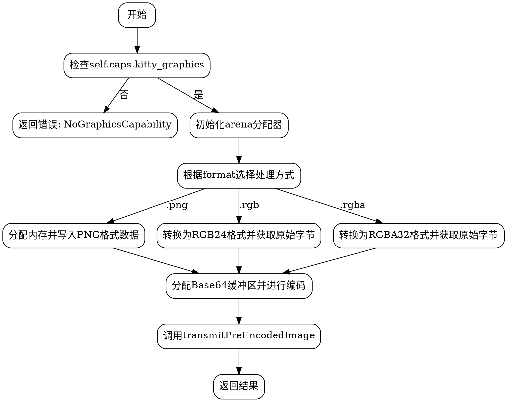

嗯，我需要为这个Zig函数transmitImage画一个流程图。首先，我得仔细理解这个函数的结构和逻辑流程。函数开始时检查self.caps.kitty_graphics是否为真，如果否的话返回错误。然后初始化一个ArenaAllocator，并确保最后会释放它。接下来根据不同的format类型处理图像数据，转换成对应的格式（png、rgb、rgba），之后进行base64编码，最后调用transmitPreEncodedImage方法。

首先，流程图应该有一个开始节点，然后是一个判断节点，检查是否有图形能力。如果否，直接结束并返回错误。如果是，进入分配arena的步骤。然后是处理不同格式的分支，这里可能会有三个分支：png、rgb、rgba。每个分支处理完成后，都会生成对应的buf。然后进行base64编码，分配b64_buf并编码数据。最后调用另一个函数transmitPreEncodedImage，并返回结果。

需要注意的是，在switch语句中，每个case处理完后都会得到buf，然后统一进行后续处理。所以流程图中这三个分支应该合并到同一个处理流程中。此外，arena的初始化和defer释放也需要在流程中体现，可能作为初始步骤的一部分。

可能容易出错的地方是各个分支的连接是否正确，以及错误处理是否完整。比如，每个步骤都可能产生错误，是否需要单独处理？但根据函数定义，可能使用try来向上抛出错误，所以流程图中可能不需要单独的错误处理节点，除了最开始的检查。

此外，函数最后返回的是调用transmitPreEncodedImage的结果，所以需要把这个步骤也画出来。还有，参数的传递，比如img.width和height的转换，可能需要作为步骤的一部分。

总结一下，流程图的结构应该是：

开始 -> 检查kitty_graphics -> 是的话初始化arena -> 根据format选择处理方式 -> 生成buf -> base64编码 -> 调用transmitPreEncodedImage -> 返回结果。如果检查失败，直接返回错误。

现在需要将这些步骤转化为graphviz的节点和箭头，注意条件判断的分支和各个步骤的顺序。
================================================
