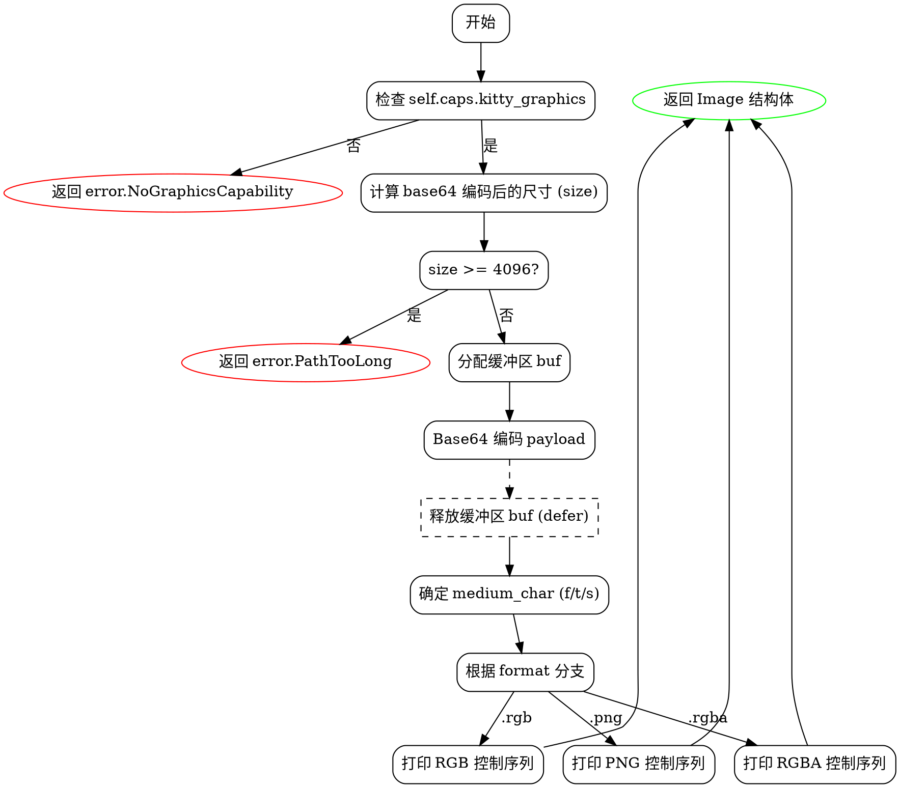

嗯，我需要为这个Zig函数transmitLocalImagePath绘制流程图。首先，我得理解这个函数的功能。看起来它是用来传输本地图片路径的，可能涉及到终端图形显示，比如Kitty终端的图形协议。

函数一开始检查self.caps.kitty_graphics是否为真，如果否，返回错误。这一步应该是一个判断节点。接着是defer self.next_img_id += 1;，这个应该在函数结束时执行，但流程图里可能需要表示它会在后续步骤之后执行。不过流程图通常是顺序结构，可能需要把defer操作放在适当的位置。

然后，函数获取id，接着计算base64编码后的尺寸，如果超过4096则报错。这里有两个判断点：一个是caps检查，另一个是size检查。之后分配内存，进行编码，然后释放内存。这部分需要注意alloc和free的顺序，虽然代码里有defer allocator.free(buf)，但流程图可能需要显示alloc之后立即使用，并在之后释放。

接下来是medium_char的switch语句，根据不同的medium选择不同的字符。然后是format的switch，分别处理rgb、rgba、png三种情况，每种情况向tty打印不同的控制序列。最后返回一个Image结构体。

流程图的步骤大概是：
1. 检查caps.kitty_graphics，失败则返回错误。
2. 计算size，如果超过限制则报错。
3. 分配buf，编码payload。
4. 确定medium_char。
5. 根据format打印不同的控制序列。
6. 返回Image结构体。

需要注意的是错误处理的分支，比如caps检查和size检查的错误路径。另外，defer语句在流程图中可能需要以某种方式表示，但通常defer是在函数退出时执行，所以可能在流程图的最后处理next_img_id的递增。或者，在流程图中，可能将next_img_id递增放在函数开始后的某个点，但根据代码，defer是在整个函数结束时执行，所以可能在流程图中作为最后一个步骤，但不在主流程中显式画出，而是作为注释说明。

另外，alloc和free虽然是成对出现，但流程图中需要显示alloc后使用，然后释放。但由于有defer，释放是在函数结束时，所以可能在流程图中，释放操作是在整个流程结束后自动执行，可能不需要单独步骤，但需要考虑是否需要表示。

可能的结构是：
开始 -> 检查caps -> 是 -> 计算size -> 是否超过4096？-> 否 -> 分配buf -> 编码 -> 释放buf（defer）-> 确定medium_char -> 根据format分支 -> 打印相应控制序列 -> 返回Image。

但需要确保释放是在编码之后，函数结束前执行。不过流程图可能更关注主要步骤，而defer可能作为隐式操作。

可能还需要注意各个步骤之间的连接，尤其是错误路径，如caps检查失败直接返回错误，size超过限制也返回错误。

最后，确保使用graphviz语法，而不是mermaid，所以需要生成dot代码。
================================================

### 流程图说明：
1. **开始**：函数入口。
2. **检查图形能力**：若终端不支持 Kitty 图形协议，直接返回错误。
3. **计算编码尺寸**：计算 Base64 编码后的尺寸，若超过 4096 则返回错误。
4. **分配与编码**：分配缓冲区并进行 Base64 编码，编码后通过 `defer` 释放缓冲区。
5. **确定介质类型**：根据 `medium` 参数选择字符 `f`/`t`/`s`。
6. **格式分支**：根据 `format` 参数选择对应的控制序列打印逻辑。
7. **返回结果**：返回包含图片 ID 和尺寸的 `Image` 结构体。

虚线框表示隐式操作（如 `defer`），红色椭圆为错误出口，绿色椭圆为正常返回。