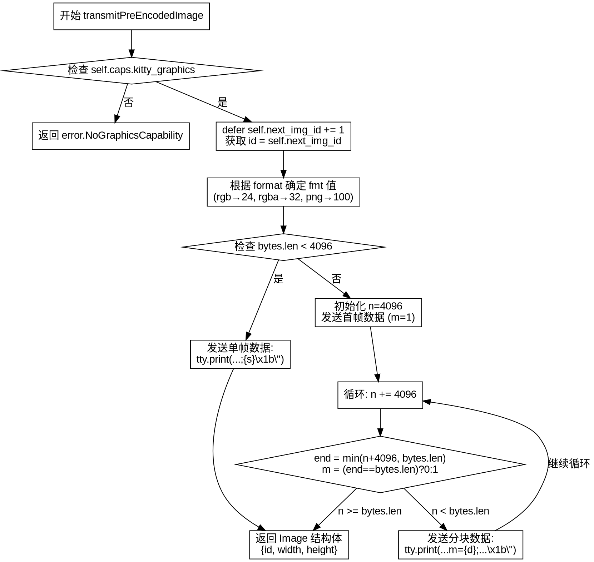

好的，我需要为给定的Zig函数transmitPreEncodedImage绘制流程图。首先，我得仔细阅读代码，理解其逻辑结构。

函数开始检查self.caps.kitty_graphics，如果不支持则返回错误。接着，defer语句增加next_img_id，并获取当前id。然后根据format确定fmt的值。接下来判断bytes的长度是否小于4096，如果小于的话，使用一个tty.print语句发送数据；否则，分块发送，每次最多4096字节，并在最后一个块设置m=0。

流程图的开始应该是函数入口，然后是一个判断节点，检查是否支持图形能力。不支持的话直接返回错误。支持的话进入后续处理。然后处理id的递增和赋值，确定fmt。接着是另一个判断节点，根据bytes长度决定走哪个分支。每个分支内部处理不同的打印逻辑，尤其是分块发送的部分需要循环处理。

需要注意循环部分的结构：初始化n=4096，然后进入循环，每次处理4096字节，直到所有数据发送完毕。循环内部需要判断是否是最后一块，设置m的值。因此，流程图里应该有循环结构，包括初始化、条件判断、发送数据块、更新n的值等步骤。

另外，返回的Image结构体也需要在流程图中体现，作为结束节点。

现在，我需要将这些步骤转化为Graphviz的流程图结构，使用节点、判断框、箭头连接等元素。确保每个逻辑分支都正确表示，特别是循环部分的结构要清晰。
================================================
