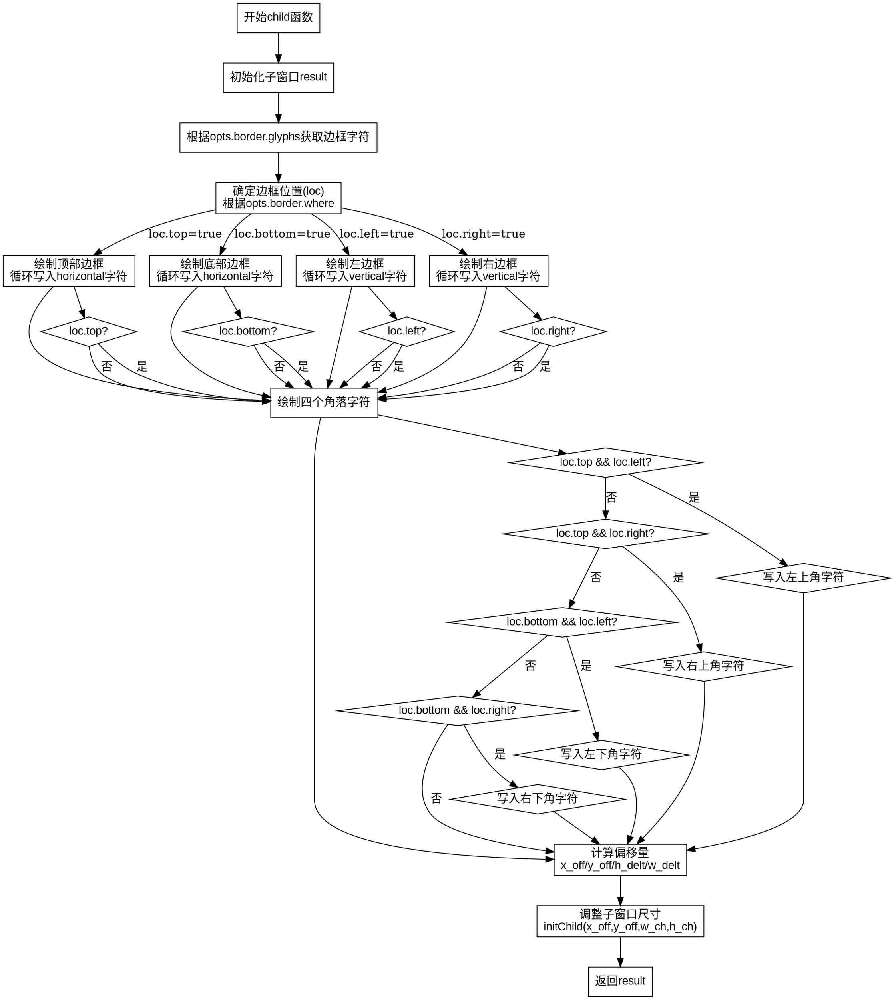

好的，我现在需要为给定的 Zig 函数绘制流程图。首先，我需要仔细阅读并理解这段代码的功能。这个函数是Window结构体的一个方法，名为child，接收ChildOptions参数，返回一个Window。主要功能是创建一个子窗口，并根据选项添加边框。

首先，函数初始化一个子窗口result，然后处理边框的字符设置。接下来根据边框的位置（loc）来绘制不同的边框线，包括顶部、底部、左右边，以及角落的字符。最后调整子窗口的偏移和尺寸，返回处理后的result。

接下来，我需要将这个过程转化为流程图。流程图的步骤应该包括：

1. 初始化子窗口。
2. 确定边框的字符（glyphs）。
3. 根据选项确定边框的位置（loc）。
4. 绘制顶部、底部、左右边框。
5. 绘制四个角落的字符。
6. 计算并调整子窗口的偏移和尺寸。
7. 返回最终的窗口对象。

需要注意的是，流程图中需要处理条件判断，例如不同的边框位置选择，以及各个边框是否绘制的条件。比如，当loc.top为真时，才会绘制顶部边框。同时，角落的绘制也依赖于相邻边是否存在（比如，当顶部和左边都存在时，才绘制左上角的字符）。

此外，在绘制流程图时，要使用Graphviz的语法，正确使用节点和箭头，表示不同的操作和条件分支。比如，使用菱形节点表示条件判断，矩形节点表示操作步骤。

需要确保每个步骤之间的逻辑关系正确，特别是条件分支后的不同路径。例如，在确定loc之后，可能会有多个并行的条件判断（如检查loc.top、loc.bottom等），每个条件判断后的绘制步骤需要正确连接。

最后，生成Graphviz的DOT代码时，要注意节点的命名和连接的顺序，确保流程图清晰易懂，正确反映函数的执行流程。
================================================
