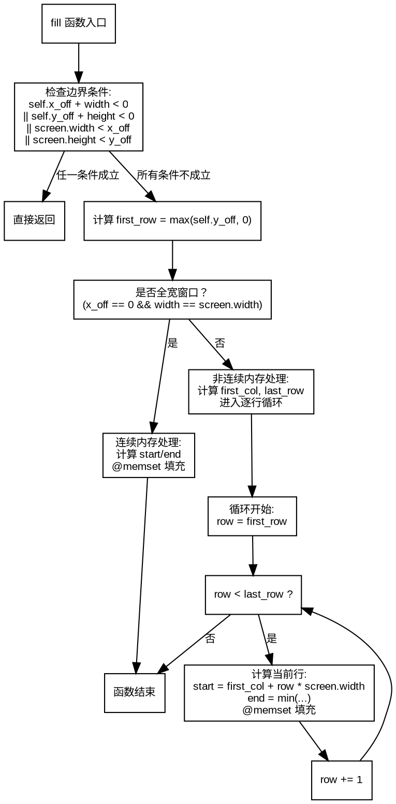

好的，我需要帮用户生成一个使用Graphviz绘制的函数流程图。用户提供的代码是Zig语言中的`fill`函数，我需要先理解这个函数的逻辑，然后根据逻辑步骤画出流程图。

首先，我仔细阅读了代码。函数`fill`的作用是填充一个窗口区域为指定的单元格。函数开始有几个条件判断，检查窗口是否在屏幕之外，如果是的话直接返回。然后根据窗口是否连续内存，分为两种情况处理。连续内存的情况使用`@memset`快速填充，非连续的情况则逐行处理。

接下来，我需要确定流程图的各个节点和分支。流程应该从函数入口开始，然后进行四个条件的判断。如果任一条件为真，直接返回。否则，继续执行。接着判断是否为全宽度窗口，如果是，计算起始和结束位置并进行内存设置；否则，进入循环逐行处理。

需要注意的是，在非连续内存的情况下，有循环结构，循环内部还有计算start和end的逻辑，并调用`@memset`。此外，循环的条件和变量的更新也需要在流程图中体现。

在绘制Graphviz图时，节点用矩形表示处理步骤，菱形表示条件判断，箭头表示流程走向。需要正确连接各个条件分支，尤其是循环部分。确保所有可能的路径都被覆盖，比如条件不满足时的流程走向。

需要避免常见的错误，比如条件判断的顺序错误，或者循环的终止条件不正确。此外，确保所有变量如`first_row`、`first_col`、`last_row`等的计算步骤正确体现在流程图中。

最后，生成正确的Graphviz代码，使用合适的节点和边，保持结构清晰，易于理解。
================================================
