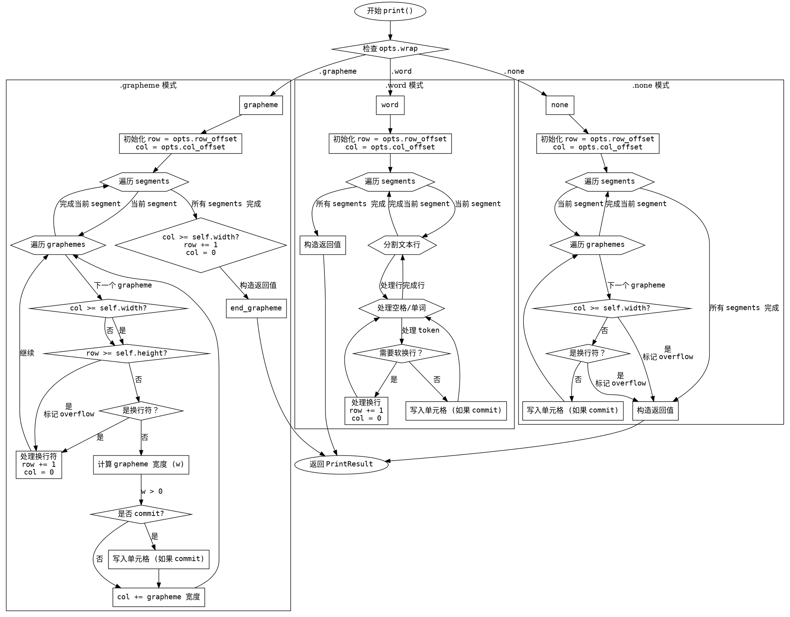

好的，我需要为提供的 Zig 函数生成一个流程图。首先，我需要仔细阅读并理解这个函数的逻辑。这个函数名为`print`，属于`Window`结构体，接受`segments`和`opts`作为参数，返回`PrintResult`。函数内部根据`opts.wrap`的不同值分为三个处理分支：`.grapheme`、`.word`和`.none`。每个分支处理文本的方式不同，涉及循环、条件判断等结构。

首先，我应该确定每个分支的基本流程。例如，在`.grapheme`模式下，函数会遍历每个`segment`，使用`graphemeIterator`处理每个字形，考虑列和行的溢出，处理换行符，计算宽度，写入单元格等。类似地，`.word`模式处理单词和空格，可能涉及分词和软换行。`.none`模式则不考虑换行，直接处理字形直到宽度限制或遇到换行符。

接下来，我需要将这些逻辑步骤转化为流程图的节点和判断条件。每个分支可能有循环结构，比如`for`循环遍历`segments`，内部的`while`循环处理每个字形或单词。条件判断如`if (col >= self.width)`或`if (row >= self.height)`需要表示为判断节点，导致不同的流程路径。

需要注意的是，流程图中应正确表示各个分支的入口和出口，以及循环和条件分支的连接。例如，在`.grapheme`分支中，处理完所有`segments`后，可能会检查`col`是否溢出，并更新`row`和`col`，最后返回结果。而在`.word`分支中，处理每个`token`（空格或单词）时，需要考虑软换行和溢出情况，可能需要嵌套的判断和循环。

此外，函数最终返回一个结构体`PrintResult`，包含`row`、`col`和`overflow`。每个分支在结束时都需要构造这个结构体返回，因此在流程图中应明确标出返回点。

在绘制流程图时，可能需要使用不同的形状来表示不同的元素：矩形框表示处理步骤，菱形表示判断条件，箭头表示流程方向。需要确保每个判断条件都有两个出口（是/否），循环结构正确闭合，避免交叉和混乱的连接。

最后，需要验证流程图的准确性和完整性，确保覆盖所有可能的执行路径，包括各种边界条件，如行或列溢出、换行符的出现、不同分词情况等。如果有遗漏或错误的理解，流程图可能无法正确反映函数的逻辑，导致后续使用或维护时的困惑。
================================================
