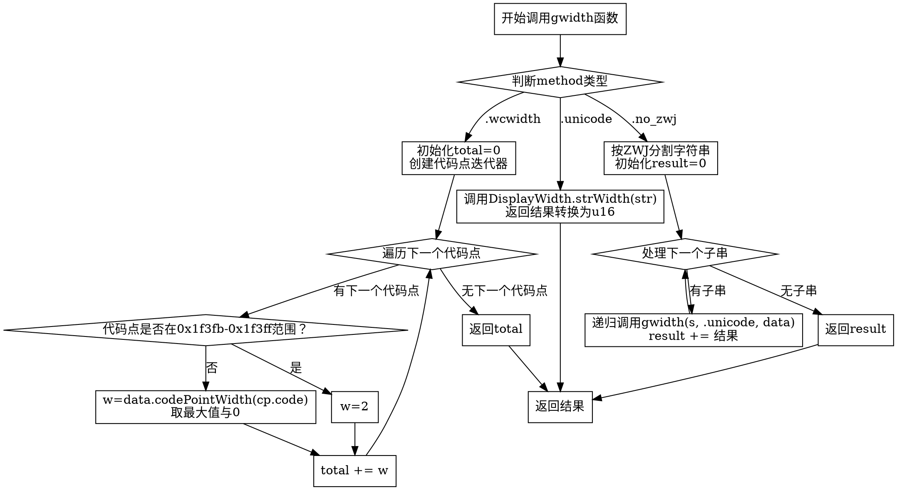

嗯，我现在需要为这个Zig函数`gwidth`绘制一个流程图。首先，我得仔细看看代码的结构，理解每个分支的逻辑。

函数`gwidth`接受三个参数：一个字符串切片`str`，一个枚举类型的`method`，和一个指向`DisplayWidthData`的指针`data`。返回类型是`u16`。函数的主要逻辑是根据`method`的不同值执行不同的计算方式。

首先，`method`有三个可能的值：`.unicode`、`.wcwidth`和`.no_zwj`。每个分支都有不同的处理流程。

1. **.unicode分支**：这里创建了一个`DisplayWidth`实例`dw`，然后调用`dw.strWidth(str)`，并将结果转换为`u16`返回。看起来这个分支直接使用Unicode标准计算字符串的显示宽度。

2. **.wcwidth分支**：这里比较复杂。初始化一个`total`变量为0，然后通过一个迭代器遍历字符串中的每个代码点。对于每个代码点，如果是0x1f3fb到0x1f3ff范围内的（即表情符号的肤色选择符），宽度设为2；否则，调用`data.codePointWidth(cp.code)`获取宽度，并确保不小于0。累加每个代码点的宽度到`total`，最后返回总和。需要注意这里的`@max(0, ...)`可能是处理负数的情况，但Zig中的`u16`应该是非负的，所以可能需要确认这里的逻辑是否有误。

3. **.no_zwj分支**：使用`std.mem.splitSequence`按零宽度连接符（U+200D）分割字符串。然后对每个分割后的子字符串递归调用`gwidth`，使用`.unicode`方法，并累加结果。这里可能存在递归调用，但需要确认是否会导致栈溢出或者性能问题，不过对于流程图来说，只需要表示这个递归过程即可。

接下来需要考虑流程图的绘制。流程图的开始是函数入口，然后根据`method`的值分为三个分支。每个分支内部的具体步骤需要分解：

- **.unicode**：直接调用`strWidth`并返回结果。
- **.wcwidth**：遍历每个代码点，判断是否在特定范围，计算宽度累加。
- **.no_zwj**：分割字符串，递归处理每个部分。

需要注意的是，在`.no_zwj`分支中，递归调用的是同一个函数，但方法参数是`.unicode`，这可能形成循环，但在流程图中应该表示为循环处理每个分割后的子字符串。

可能的错误点在于对各个分支的条件判断是否正确，尤其是`.wcwidth`中的代码点范围处理和递归调用的正确表示。另外，确保流程图的箭头和判断节点正确无误，不会遗漏任何步骤。

现在，根据这些分析，可以开始绘制流程图。使用Graphviz的话，需要用节点和边来表示各个步骤。可能需要使用菱形节点表示条件判断（如switch语句），矩形节点表示处理步骤，箭头表示流程方向。
================================================

这个Graphviz流程图清晰地展示了：
1. 函数入口通过switch判断method类型
2. .unicode分支直接调用底层方法返回结果
3. .wcwidth分支的代码点遍历和特殊范围判断逻辑
4. .no_zwj分支的字符串分割和递归调用流程
5. 所有分支最终汇聚到返回结果的结束节点

每个处理步骤使用矩形节点，条件判断使用菱形节点，箭头上的标签说明了流程转移的条件。递归调用表现为循环处理分割后的子串，而代码点遍历则通过循环结构实现。