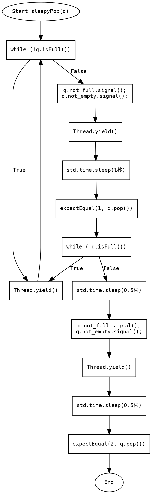

嗯，我需要根据提供的Zig代码`sleepyPop`函数来生成一个Graphviz的流程图。首先，我得仔细理解这个函数的功能和各个步骤。

函数`sleepyPop`的参数是一个指向`Queue(u8, 2)`的指针，返回一个错误联合类型。看起来这个函数是用于从一个队列中弹出元素的，但过程中涉及到多线程的同步操作，比如等待队列满、发送信号唤醒其他线程、让出线程执行权、睡眠等待等。

首先，函数开始时会进入一个循环，不断检查队列是否已满。如果没满，就调用`Thread.yield()`让出CPU，直到队列满为止。接下来，函数会主动触发`not_full`和`not_empty`的信号，这可能是在模拟虚假唤醒的情况，即即使条件未满足，也发送信号让等待的线程继续执行。

然后，再次调用`Thread.yield()`，并睡眠一纳秒（不过代码中用的是`std.time.ns_per_s`，这应该是一秒的纳秒数，即1秒的睡眠？这里可能需要确认代码是否正确，因为通常`std.time.sleep`的参数是纳秒数，所以`std.time.ns_per_s`表示1秒）。之后，尝试从队列中弹出元素，预期是1。

接着，再次进入循环等待队列满，然后睡眠半秒。再次发送虚假信号，让出执行权并睡眠半秒。最后弹出元素，预期是2。

接下来，我需要将这些步骤转化为流程图。流程图的节点应该是各个操作步骤，边表示控制流。需要注意循环结构、条件判断以及并发的信号操作。不过由于Graphviz主要处理静态流程，并发部分可能需要用注释或特殊节点表示。

可能的步骤如下：

1. 开始节点：进入函数。
2. 循环判断队列是否满，如果不满则yield。
3. 发送not_full和not_empty信号。
4. yield和睡眠1秒。
5. 弹出元素并检查是否为1。
6. 再次循环等待队列满。
7. 睡眠半秒。
8. 再次发送信号。
9. yield和睡眠半秒。
10. 弹出元素检查是否为2。
11. 结束节点。

需要注意的是循环结构，比如第一个`while (!q.isFull())`循环，可能需要用条件判断节点表示循环的进入和退出。此外，`Thread.yield()`和`sleep`属于等待或延迟操作，可以用不同的形状或颜色标记。

可能的结构：

- 开始
- 进入第一个while循环：条件判断队列是否满，不满则执行yield并循环。
- 退出循环后执行signal操作。
- 执行yield和sleep。
- 弹出元素并检查。
- 进入第二个while循环，同样判断队列是否满。
- 退出循环后sleep半秒。
- 再次signal，yield，sleep。
- 弹出元素并检查。
- 结束。

需要将这些步骤用Graphviz的节点和边连接起来，正确表示流程的顺序和循环结构。例如，循环部分可以用条件节点，条件为真时返回循环体，否则继续后续步骤。

另外，要注意代码中的两次sleep和两次signal操作，这些都需要在流程图中体现。例如，在第一次发送信号后，执行yield和sleep，然后进行expect检查。第二次循环等待队列满后，再次sleep和signal，最后检查第二个弹出。

最后，确保流程图中的每个步骤都对应代码中的操作，没有遗漏或错误。特别是循环和条件判断的位置要准确。
================================================

该流程图使用Graphviz的DOT语言绘制，关键节点说明如下：

1. **循环检测队列满**：通过`while (!q.isFull())`循环等待队列填满，循环内通过`Thread.yield()`让出CPU
2. **主动唤醒信号**：通过`not_full`和`not_empty`信号模拟虚假唤醒
3. **双重等待策略**：通过`yield()`和`sleep(1秒)`确保其他线程有机会执行
4. **二次阻塞检测**：再次等待队列填满，并通过更短的`sleep(0.5秒)`确保二次压入操作被阻塞
5. **最终消费验证**：分两次弹出元素并验证值（1和2），体现队列的线程安全特性

箭头方向表示程序执行流向，菱形节点隐含条件判断逻辑（通过边的True/False标签区分）。