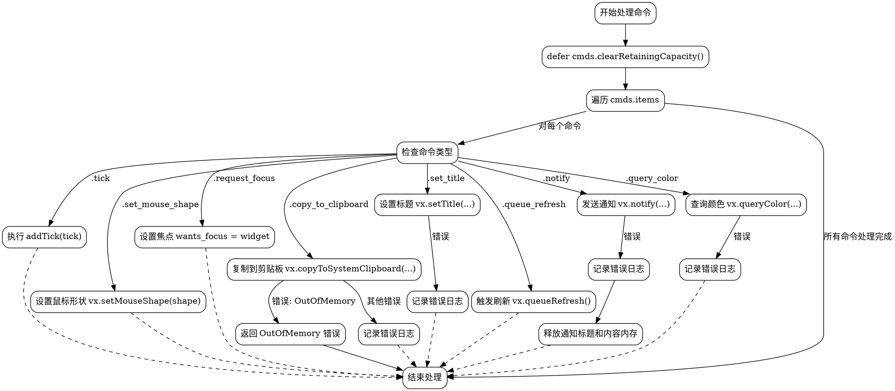

好的，我需要为给定的Zig函数绘制流程图。首先，我应该仔细阅读代码，理解每个部分的功能。

函数handleCommand接收App指针和CommandList指针，返回可能的分配器错误。开始时有defer语句，确保在函数结束时清除命令列表。然后遍历每个命令，根据不同的命令类型执行相应操作。

每个命令对应不同的处理逻辑：例如.tick会调用addTick，.set_mouse_shape设置鼠标形状，.copy_to_clipboard处理剪贴板复制，并捕获可能的错误。特别是.copy_to_clipboard中的错误处理需要区分OutOfMemory和其他错误。其他命令如.set_title、.notify等也有各自的处理步骤和错误处理。

接下来，我需要将这些逻辑步骤转化为流程图的结构。流程图的开始是函数入口，然后处理每个命令。每个命令分支需要详细展示其处理过程和可能的错误路径。例如，对于.copy_to_clipboard，成功则继续，遇到OutOfMemory则返回错误，其他错误记录日志。同样，其他命令的错误处理也需要在流程图中体现。

需要注意循环处理所有命令项，以及defer的清除操作。此外，确保每个命令分支的正确连接，包括错误处理和正常流程的继续。

最后，使用Graphviz的DOT语言来结构化这些步骤，确保节点和边的正确连接，反映函数的执行流程。
================================================
