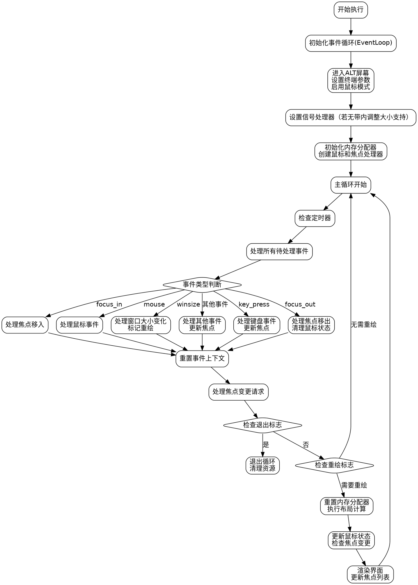

好的，我需要根据用户提供的Zig代码绘制一个流程图，使用Graphviz而不是Mermaid。首先，我得仔细阅读这段代码，理解它的结构和逻辑流程。

首先，函数名为`run`，属于`App`结构体。它接受一个`Widget`和`Options`作为参数，返回一个错误类型。函数的主要逻辑似乎是在处理事件循环、终端设置、定时器、焦点和鼠标事件，以及界面渲染。

接下来，我需要分解函数的主要步骤：

1. **初始化和设置**：初始化事件循环（`EventLoop`），进入终端屏幕，设置终端参数（如粘贴模式、颜色方案等），处理终端调整大小的信号。
2. **事件循环处理**：包括处理键盘事件、焦点事件、鼠标事件、窗口大小变化等。
3. **定时器和帧率控制**：根据设定的帧率计算每个帧的时间间隔，控制循环的节奏。
4. **布局和渲染**：在需要重绘时，进行布局计算，处理鼠标悬停和焦点变化，最后渲染界面。
5. **退出条件**：检查是否收到退出信号，决定是否退出循环。

需要注意的是，代码中有多个条件判断和循环，例如处理不同事件类型、是否需要重新布局等。此外，涉及到资源管理，如`defer`语句用于释放资源。

在绘制流程图时，我需要将这些步骤模块化，并用适当的控制结构（如条件分支、循环）连接起来。需要特别注意事件处理的不同分支，比如处理`.key_press`、`.focus_out`、`.mouse`等不同事件类型的路径。

另外，函数中有多个`try`和错误处理，但在流程图中可能不需要详细表示错误处理路径，除非用户特别要求。重点应放在主流程上。

可能的结构如下：

- 开始
- 初始化事件循环和终端设置
- 进入主循环
  - 处理定时器和等待下一帧
  - 处理所有待处理事件
    - 根据不同事件类型分支处理
  - 处理焦点变化
  - 检查退出条件
  - 重绘界面（如果需要）
- 结束

需要确保每个步骤之间的逻辑关系清晰，条件判断正确表示。例如，在事件处理部分，每个事件类型对应不同的处理逻辑，需要用条件分支表示。

在绘制Graphviz图时，使用节点表示步骤，箭头表示流程方向，条件分支用菱形节点，并用标签说明条件。

最后，确保没有使用Mermaid语法，严格按照Graphviz的语法结构来编写。
================================================

该流程图使用Graphviz语法绘制，主要特点：
1. 使用菱形节点表示条件判断
2. 使用箭头标签明确事件路由
3. 保持与源码一致的关键流程节点：
   - 终端初始化
   - 事件循环处理
   - 焦点系统管理
   - 定时器控制
   - 渲染管线
4. 突出显示核心循环结构
5. 明确资源清理路径（defer语句对应的逻辑）