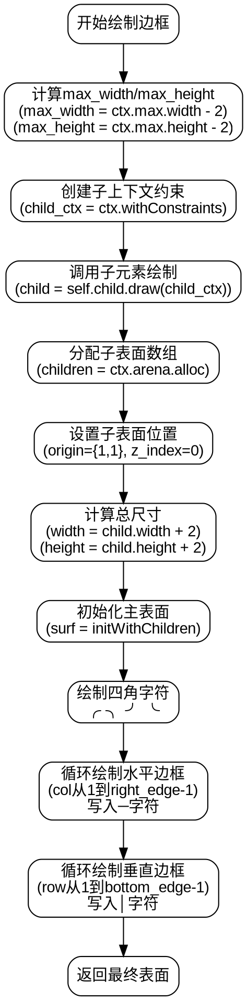

好的，我需要为给定的Zig函数生成流程图。首先，我需要理解这个函数的功能。函数名为draw，属于Border结构体，接受一个DrawContext参数，返回一个Surface或者Allocator.Error。函数的主要作用似乎是绘制一个带有边框的界面元素。

首先，函数处理了最大宽度和高度，减去了2，可能是为了给边框留出空间。然后创建了一个子上下文child_ctx，调整了约束条件。接着调用self.child.draw(child_ctx)来绘制子元素，这可能是一个嵌套的组件。

然后，分配了一个子表面数组children，并将子元素的表面放置在位置(1,1)，这样周围就有空间绘制边框。接下来计算了整个表面的大小，即子元素的大小加2，确保边框的左右和上下各有1单位的空间。

之后，使用initWithChildren创建了主表面surf，并开始绘制边框的各个部分。四个角落使用了不同的字符（如╭、╮、╯、╰），然后通过循环绘制了上下边缘的“─”和左右边缘的“│”。

流程图需要涵盖这些步骤：处理约束条件、绘制子元素、创建主表面、绘制边框的各个部分。需要注意条件判断和循环结构。例如，处理max_width和max_height时的条件判断，以及后续的循环绘制边框线条。

在绘制流程图时，应使用Graphviz的DOT语言，确保节点和边的正确连接。每个主要步骤作为一个节点，条件判断可能有分支，但在此函数中，条件判断似乎没有导致分支，而是简单的值计算。循环部分需要表示为重复操作的过程。

需要注意可能的错误点，比如循环变量是否正确递增，边界条件是否正确处理（如right_edge和bottom_edge的计算是否准确）。但根据代码中的减1操作（-| 1），应该正确避免了溢出。

最后，确保流程图的逻辑顺序正确，从开始到结束，每个步骤按顺序执行，包括错误处理（如try可能引发的错误传播）。
================================================
