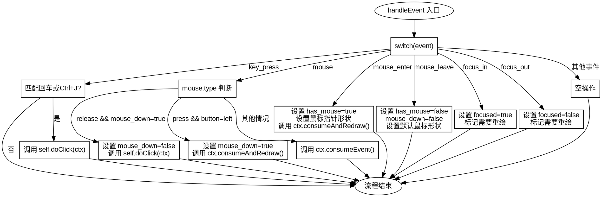

好的，我需要为提供的Zig函数`handleEvent`绘制一个流程图。首先，我需要理解这个函数的结构和逻辑。函数处理不同的事件类型，每个事件类型有不同的处理逻辑。例如，对于`key_press`事件，检查是否按下了回车键或Ctrl+J，如果是，则执行`doClick`。对于`mouse`事件，处理鼠标按下和释放的情况，设置`mouse_down`状态，并调用相应的方法。还有处理鼠标进入、离开、焦点进入和离开的事件，以及其他情况的默认处理。

接下来，我需要将这些逻辑转换为流程图。流程图应该从函数入口开始，根据不同的事件类型分支处理。每个事件类型对应一个判断框，然后根据条件进一步分支。例如，对于`key_press`事件，需要判断按键是否符合条件；对于`mouse`事件，需要判断是按下还是释放，以及按钮是否为左键。

需要注意的是，每个分支结束后可能需要返回或继续处理其他事件。例如，处理完`key_press`后直接返回`doClick`，而处理`mouse`事件时，在释放左键后返回`doClick`，按下左键则设置`mouse_down`并调用`consumeAndRedraw`。其他事件如`mouse_enter`、`mouse_leave`、`focus_in`、`focus_out`也有各自的处理步骤和返回点。

需要确保流程图正确反映每个条件判断和处理流程，包括返回语句和状态更新。同时，注意不要遗漏任何事件类型，如`else`分支处理其他未明确处理的事件。

最后，使用Graphviz的DOT语言来描述流程图的结构，确保节点和边的正确连接，每个条件分支和操作步骤都清晰表示出来。
================================================
