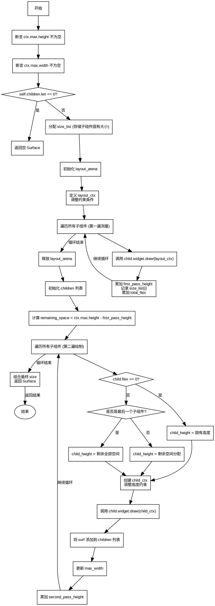

嗯，我需要为这个Zig函数draw绘制流程图。首先，我得理解这个函数的功能。看起来这是一个FlexColumn组件的绘制函数，用于布局子组件。函数接收一个FlexColumn实例和一个DrawContext，然后返回一个Surface或者分配错误。

首先，函数开始时有两个断言，确保ctx.max的高度和宽度不为null。如果子组件列表为空，直接返回一个最小尺寸的Surface。这部分应该对应流程图的开始部分和第一个判断。

接下来，函数分配了一个size_list数组来存储每个子组件的固有大小。然后创建了一个layout_arena，可能是用于临时内存分配。之后定义了一个layout_ctx，调整了min和max的约束，特别是max的高度设为null，可能是在第一遍测量子组件的高度。

然后进入第一个循环，遍历所有子组件，调用它们的draw方法，累加first_pass_height和total_flex，同时记录每个子组件的高度到size_list。这部分应该是流程图中的一个循环结构。

完成第一遍测量后，释放layout_arena。接下来准备第二次绘制，初始化children列表，用于存储子Surface。然后计算剩余空间remaining_space，根据flex值分配高度给每个子组件。这里有一个条件判断，处理flex为0的情况，以及最后一个子组件占据剩余空间的情况。

在第二个循环中，为每个子组件创建child_ctx，调整高度约束，再次调用draw方法，生成surf，并添加到children中。同时更新max_width和second_pass_height。这部分也是一个循环结构，包含条件判断。

最后，组合所有子组件的尺寸，返回最终的Surface对象，包含大小、组件信息和子组件列表。

在画流程图时，需要注意各个步骤的顺序，条件分支（比如子组件是否为空，flex是否为0，是否是最后一个子组件），以及两个循环结构。可能需要使用开始/结束节点、处理步骤、判断节点、循环结构等元素。需要确保每个判断的分支正确，流程连贯。

可能需要先画出开始节点，然后是两个断言，接着判断是否有子组件，如果没有直接返回。如果有，进入分配size_list和创建layout_arena的步骤。然后第一个循环处理所有子组件的第一遍测量，之后释放arena。接着处理剩余空间，进入第二个循环，处理每个子组件的实际绘制，并收集结果。最后组合结果并返回。

要注意流程图中各个步骤之间的连接线，正确表示程序的控制流。例如，第一个循环结束后进入第二个循环，每个循环内部的处理步骤，以及条件判断后的不同路径。

可能还需要处理错误情况，比如内存分配错误，但函数返回的是Allocator.Error，可能在流程图中用异常处理节点表示，但原函数中使用了try，可能错误会向上传递，所以流程图可能不显式处理错误，而是作为可能的出口。

总之，需要将代码逻辑分解为流程图的基本元素，确保逻辑正确，步骤清晰，条件分支正确表示。
================================================
