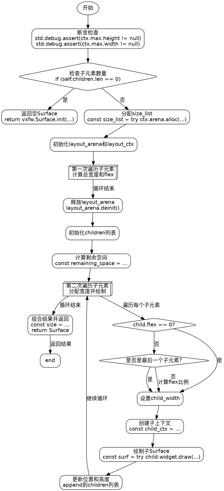

嗯，我需要用Graphviz来绘制这个Zig函数的流程图。首先，我得仔细读代码，理解每个步骤的作用，然后分解成流程图中的各个节点和边。

函数开始有两个断言，检查ctx.max的高度和宽度是否不为空。接着如果children的长度为0，就直接返回一个初始化的Surface。这部分应该对应流程图的开始部分，判断是否有子元素。

接下来，代码分配了一个size_list数组，用来存储每个子部件的固有大小。然后创建了一个layout_arena和layout_ctx，进行第一次遍历子元素，计算总宽度和总flex值。这里可能需要一个循环节点，处理每个子元素。

然后释放layout_arena，进入第二次遍历，这次根据剩余空间和flex值分配每个子部件的宽度，并再次绘制。这又是一个循环，需要处理每个子元素，计算宽度，创建子上下文，绘制，并更新位置和高度。

最后，组合所有子Surface，返回最终的Surface结果。这部分对应流程图的结束节点。

需要注意条件判断，比如flex是否为0，是否是最后一个子元素，这些会导致不同的路径。在流程图中，条件判断应该用菱形节点表示，分支不同的处理流程。

可能需要将代码分解为以下步骤：
1. 开始，检查断言。
2. 判断是否有子元素，没有则返回。
3. 分配size_list，初始化布局环境。
4. 第一次循环遍历子元素，收集固有宽度和总flex。
5. 释放布局环境。
6. 第二次循环遍历子元素，计算每个的实际宽度，绘制子Surface。
7. 组合结果，返回Surface。

每个循环内部的结构需要详细表示，特别是条件判断处理不同的情况。比如在第二次循环中，处理flex是否为0，是否是最后一个子元素，从而决定宽度分配方式。

需要确保流程图的节点和边正确反映代码的执行顺序和逻辑分支。使用Graphviz的语法，用不同的形状表示不同节点类型，比如矩形表示操作，菱形表示判断，箭头表示流程方向。
================================================

该流程图使用Graphviz的DOT语言绘制，包含以下关键节点：
1. 开始时的断言检查
2. 空子元素的快速返回路径
3. 第一次遍历用于收集固有尺寸
4. 第二次遍历的动态宽度分配
5. 包含两个嵌套条件判断（flex是否为0/是否是最后一个子元素）
6. 最终结果组合阶段

流程图中使用：
- 椭圆形表示开始/结束
- 菱形表示条件判断
- 矩形表示操作步骤
- 3D盒子表示循环结构
- 箭头上的文字描述分支条件