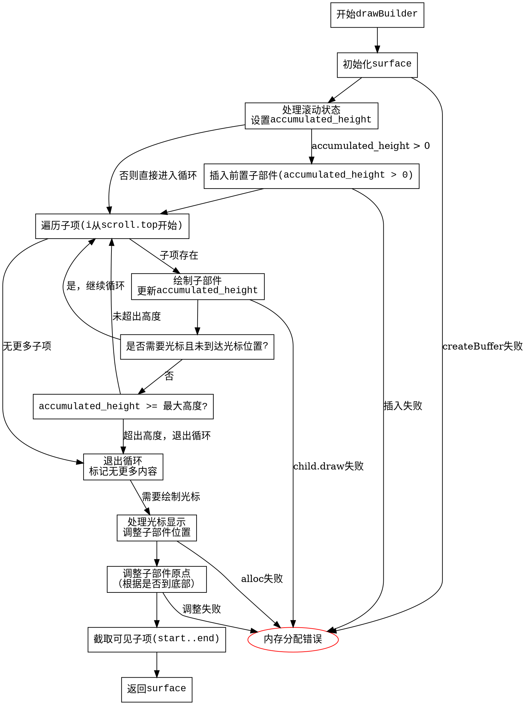

嗯，用户让我用Graphviz来画这个Zig函数的流程图。首先，我需要理解这个函数的结构和逻辑流程。这个函数是ListView的drawBuilder方法，看起来负责绘制列表视图，处理滚动、子部件的布局以及光标显示等。

首先，函数开始处设置surface，处理滚动相关的变量，比如accumulated_height，然后进入循环处理每个子项。接着有一些条件判断，比如是否绘制光标，处理滚动后的位置调整，最后处理子部件的布局和可见性。

我需要将这些步骤分解成流程图中的各个节点，包括开始、结束、条件判断、循环、函数调用等。要注意每个条件分支，比如if语句和while循环的退出条件，以及可能的错误处理（比如Allocator.Error）。

可能的步骤：
1. 开始函数，初始化surface。
2. 处理滚动状态，设置accumulated_height。
3. 处理子部件的插入，可能有前置插入。
4. 进入循环遍历子项，绘制每个子项，更新accumulated_height。
5. 处理光标显示，调整子部件位置。
6. 调整子部件的可见范围，设置surface.children。
7. 返回surface。

需要注意的细节：
- 多个条件分支，如if (self.draw_cursor)、if (accumulated_height > 0)等。
- while循环中处理子项的绘制。
- 可能的错误处理（try语句）。
- 最后的子列表截取（start..end）。

接下来，我需要将这些步骤用Graphviz的节点和边表示出来，使用正确的形状（如矩形表示步骤，菱形表示条件判断），并确保流程逻辑正确。
================================================
