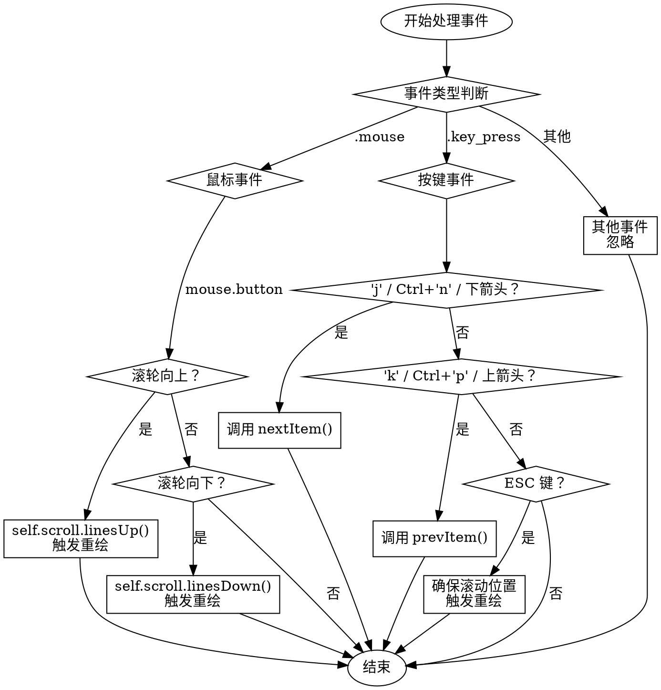

嗯，我需要为这个Zig函数生成一个流程图。首先，我得理解这个函数的结构。这个函数是`handleEvent`，属于`ListView`结构体。它处理事件，包括鼠标和键盘事件。

首先，函数开始处理事件，根据事件的类型进行分支。事件分为鼠标事件和按键事件，其他事件则忽略。对于鼠标事件，如果是滚轮向上或向下，就调整滚动条，并可能触发重绘。对于按键事件，检查不同的按键组合，比如j、n+Ctrl、下箭头等，对应不同的操作，如移动到下一个项目或上一个项目。还有Esc键的处理，确保滚动位置并重绘。

接下来，我需要将这些逻辑转化为流程图。流程图应该从开始处理事件开始，然后根据事件类型分支。每个分支内的条件判断和操作都需要用不同的节点表示。需要注意的是，条件判断（如if语句）要用菱形框，操作用矩形框，流程箭头表示执行顺序。

可能需要注意的地方是，`key.matches`有多个条件，需要用逻辑或连接，这在流程图中如何表示？可能需要用多个判断节点，或者合并成一个条件。比如，对于按键事件中的第一个条件，判断是否是j、Ctrl+n或下箭头，这三个条件满足任何一个就执行`nextItem`。这里可能需要一个合并的条件判断，表示任一条件成立。

另外，每个条件判断后的操作，如`ctx.consumeAndRedraw()`或调用`nextItem`/`prevItem`，需要明确标出。还有，处理完每个事件后流程如何结束或继续。

还要注意，流程图是否符合graphviz的语法，比如节点和边的定义，不能使用mermaid的语法。需要确保使用正确的graphviz结构，如使用`digraph`，节点用方框和菱形，箭头用->连接。

现在，我需要将这些步骤结构化，确保每个判断和操作都正确对应到流程图的节点和边。可能需要多次检查条件分支是否正确，特别是多个条件合并的情况。同时，确保没有遗漏任何可能的路径，比如else情况或默认处理。
================================================
