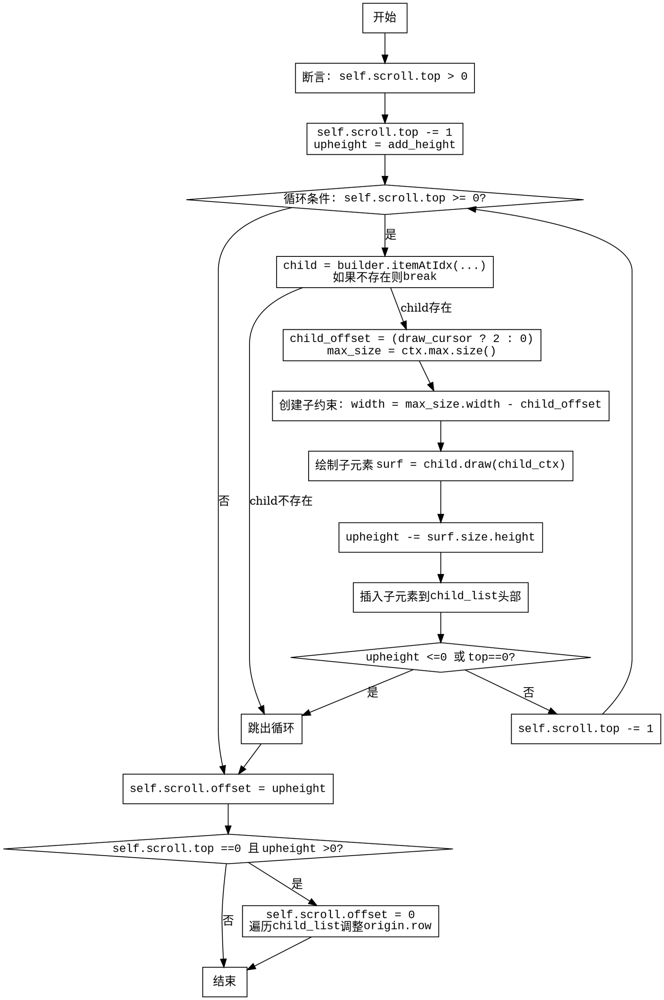

嗯，用户让我用Graphviz来画这个Zig函数的流程图。首先，我需要理解这个函数的功能。函数名是insertChildren，看起来是向列表视图中插入子元素。参数有self、ctx、builder、child_list和add_height。返回类型是可能抛出分配器错误。

首先，函数开始有一个断言，检查self.scroll.top是否大于0。然后，self.scroll.top减1。接着定义了一个upheight变量，初始值为add_height。然后进入一个while循环，条件是self.scroll.top >= 0，每次循环self.scroll.top减1。

循环内部，首先通过builder.itemAtIdx获取child，如果不存在则跳出循环。然后计算child_offset，根据是否绘制光标来决定是2还是0。获取max_size，然后创建子上下文child_ctx，设置宽度为max_size.width减去child_offset，高度为0，可能允许子元素自己决定高度。

接下来绘制子元素surf，并更新upheight减去surf的高度。然后将子元素插入到child_list的开头，设置origin的列和行。之后检查upheight是否小于等于0或者self.scroll.top是否为0，如果是则跳出循环。

循环结束后，设置self.scroll.offset为upheight。然后有一个条件判断，如果self.scroll.top为0且upheight大于0，则重置offset为0，并遍历child_list调整每个子元素的origin.row，最后再次设置self.scroll.offset为upheight。

接下来要画出流程图，需要将每个步骤转化为节点，并用箭头连接。需要注意的是循环和条件分支的结构。比如，while循环的条件判断，循环内的break条件，以及最后的if条件处理。

可能的结构是：

开始 -> 断言检查 -> 初始化变量 -> 进入循环 -> 获取child -> 计算约束 -> 绘制子元素 -> 更新upheight -> 插入到列表 -> 检查退出条件 -> 循环继续或退出 -> 设置offset -> 检查是否需要重置 -> 调整origin -> 结束。

需要注意条件分支的处理，比如在循环内部有两个break条件，一个是获取child失败，另一个是upheight<=0或top为0。循环结束后处理可能的offset重置。

在Graphviz中，使用节点和边，条件判断可以用菱形节点，操作用矩形节点。可能需要处理循环的返回箭头，比如while循环的条件判断后继续循环体或者退出。

需要确保流程图的逻辑正确，覆盖所有分支，特别是循环内的多个退出条件和最后的if条件。可能还需要处理异常情况，比如Allocator.Error，但用户可能不需要显示错误处理，因为函数只是返回错误类型，但实际流程中可能没有处理错误的节点。

最后，生成正确的DOT代码，确保节点和边的连接正确，标签清晰。
================================================
