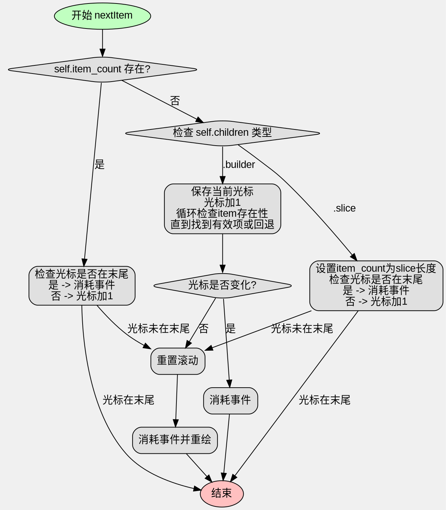

嗯，我需要为这个Zig函数nextItem画一个流程图。首先，我得理解这个函数的结构和逻辑流程。函数开始检查self.item_count是否存在。如果有的话，处理比较简单：如果光标已经在最后一个元素，就消耗事件；否则，光标加一，重置滚动，然后消耗事件并重绘。

如果item_count不存在，那么要看children的类型。如果是slice，就设置item_count为slice的长度，同样检查光标是否在末尾，不在的话光标加一。如果是builder类型，保存当前光标位置，尝试增加光标，然后循环检查是否存在对应的item，直到找到存在的项或者回退到原来的位置。如果光标没变，就消耗事件；否则，同样重置滚动并重绘。

接下来，我需要把这些逻辑步骤转化为流程图。流程图应该从函数入口开始，分支判断item_count是否存在。然后根据不同的分支处理不同的情况，包括slice和builder的不同处理方式。每个判断后的操作步骤需要用流程图的节点表示，比如判断框、处理步骤、结束等。

需要注意的是循环处理builder的情况，这里有一个while循环，需要正确表示循环的条件和退出条件。另外，每个可能的路径都要覆盖到，比如当cursor在slice末尾时直接返回，或者在builder情况下光标没有变化时也直接返回。

可能容易出错的地方是循环条件的表示，以及确保所有条件分支都被正确连接。同时，要区分不同的处理路径，避免混淆slice和builder的情况。另外，最后的步骤如重置滚动和重绘需要正确连接到各个可能的分支之后，除了那些直接返回的情况。

最后，确保流程图符合Graphviz的语法，使用正确的节点和箭头连接，每个判断框有两个出口（是/否），处理步骤用矩形框，开始和结束用椭圆等。需要检查每个路径是否正确，没有遗漏任何步骤。
================================================
