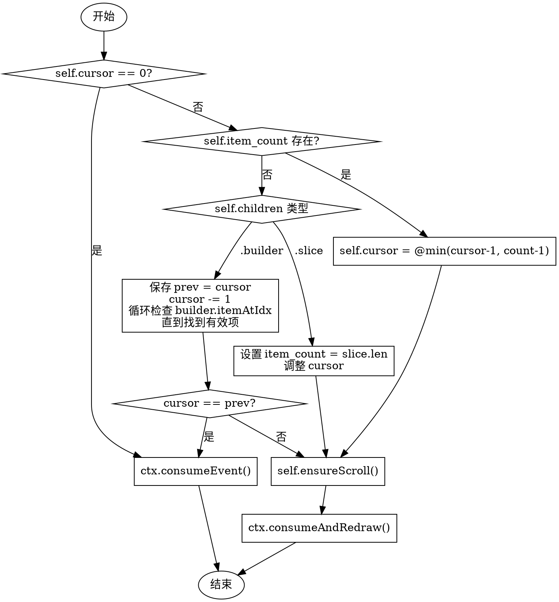

嗯，我需要为这个Zig语言的函数prevItem绘制流程图。首先，我得理解这个函数的逻辑。函数的作用是处理列表视图中移动到上一个项目的操作。让我仔细读一遍代码。

函数开始检查self.cursor是否为0，如果是的话，直接消费事件并返回。这说明当光标在第一个位置时，无法再向上移动，所以直接结束。

接下来，如果有item_count存在，那么将光标减1，但不超过count-1。这部分应该是处理已知项目数量的情况，确保光标不越界。

如果item_count不存在，那么进入switch语句，根据children的类型处理。如果是slice类型，获取切片长度作为项目数量，并调整光标。如果是builder类型，处理更复杂：先保存当前光标位置，然后递减光标，循环检查是否存在有效项目，如果没有则继续递减，直到找到有效项或光标不变。如果光标没变，就消费事件不重绘；否则继续。

最后，无论哪种情况，都会调用ensureScroll重置滚动，并消费事件且重绘。

接下来，我需要把这些逻辑步骤转化为流程图。流程图应该包括开始、条件判断、不同的处理分支，以及结束步骤。

需要注意的是，graphviz的语法结构，使用节点和边连接。可能需要使用菱形表示条件判断，矩形框表示处理步骤，箭头表示流程方向。

可能的节点包括：

1. 开始节点。
2. 检查cursor是否为0。
3. 处理item_count存在的分支。
4. 处理slice的情况。
5. 处理builder的情况，包括循环检查item存在。
6. 检查光标是否改变。
7. 调用ensureScroll。
8. 结束节点（消费事件并重绘或仅消费事件）。

需要确保所有条件分支正确连接，特别是builder情况下的循环处理。同时，注意处理不同的返回路径，比如当cursor未改变时直接返回消费事件，而不执行ensureScroll和重绘。

可能的结构如下：

开始 → cursor == 0？是→消费事件并返回；否→检查item_count是否存在？

如果item_count存在，调整cursor，然后到ensureScroll → 消费并重绘。

如果item_count不存在，进入children类型判断：

- slice：设置item_count和cursor → ensureScroll → 消费并重绘。
- builder：保存prev_cursor，cursor减1 → 循环检查item是否存在，继续减cursor → 检查cursor是否等于prev → 是→消费事件返回；否→ensureScroll → 消费并重绘。

需要将这些步骤用graphviz的语法正确表示出来，注意节点之间的连接和条件分支的标签。
================================================
