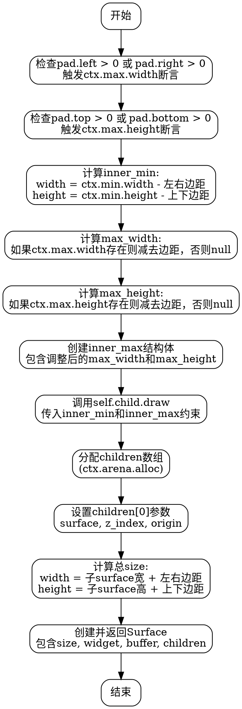

好的，我需要为提供的Zig函数`draw`生成一个流程图。首先，我需要仔细阅读代码，理解每个步骤的作用，然后将其分解成流程图中的各个节点。

函数`draw`的主要步骤看起来是这样的：

1. 检查左右或上下边距是否大于0，并断言`ctx.max`的宽度或高度不为null。
2. 计算`inner_min`的尺寸，减去边距后的最小宽度和高度。
3. 计算`max_width`和`max_height`，同样减去边距后的最大值，可能为null。
4. 创建`inner_max`结构，包含调整后的最大尺寸。
5. 调用子组件的`draw`方法，传入调整后的约束条件，得到`child_surface`。
6. 分配内存给子组件数组`children`，并设置其位置和z-index。
7. 计算最终的`size`，包含边距的总宽度和高度。
8. 创建并返回新的`Surface`，包含尺寸、组件信息、空缓冲区以及子组件列表。

接下来，我需要将这些步骤转化为流程图中的各个节点，并确定它们之间的逻辑流向。需要注意条件判断部分，比如关于`pad.left`和`pad.right`的检查，以及`ctx.max.width`是否为null的情况处理。

可能的节点包括：

- 开始
- 检查pad.left和pad.right是否大于0，触发断言
- 检查pad.top和pad.bottom是否大于0，触发断言
- 计算inner_min
- 计算max_width和max_height
- 创建inner_max
- 调用child.draw
- 分配children数组
- 设置children[0]的参数
- 计算总size
- 创建并返回Surface

流程图中需要正确连接这些节点，反映代码的执行顺序和条件分支。例如，检查左右边距可能导致断言，但不影响流程继续。计算max_width和max_height时，根据ctx.max.width是否为null进行分支处理，但可能合并为同一节点，因为代码中使用的是条件表达式。

此外，函数返回的创建Surface是最后一步，应作为流程图的结束节点。

需要注意，在生成Graphviz代码时，确保节点之间的箭头正确表示流程顺序，条件判断可能需要菱形节点，但根据代码中的结构，断言可能只是简单的检查，不形成分支，因此可能不需要条件节点，而是顺序执行。

可能的结构是顺序执行，各步骤依次连接，没有条件分支，因为即使断言失败，可能视为错误处理，但函数本身并未处理，只是触发断言。因此，在流程图中可以忽略断言失败的情况，假设断言成功，继续执行。

最终，将这些步骤转换为Graphviz的节点和边，使用正确的语法结构，如`digraph`，节点定义，箭头连接等。
================================================
