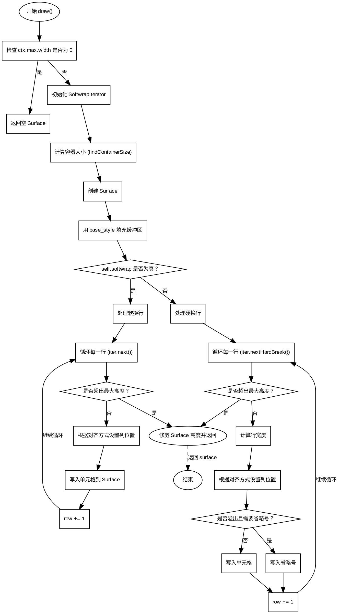

好的，我需要为提供的Zig函数`draw`生成一个流程图。首先，我需要理解这个函数的结构和逻辑。

函数`draw`接受一个`RichText`对象和一个`DrawContext`，返回一个`Surface`或分配错误。主要逻辑分为处理软换行和硬换行两种情况，根据不同的文本对齐方式和溢出处理来绘制文本。

首先，函数检查`ctx.max.width`是否为0，如果是，直接返回一个空的Surface。否则，初始化一个`SoftwrapIterator`，计算容器大小，创建Surface，并用基本样式填充缓冲区。

接下来，根据`self.softwrap`的值分为两种情况处理：

1. **软换行开启**：逐行处理，每行根据对齐方式调整列位置，逐个单元格写入Surface。
2. **软换行关闭**：处理硬换行，计算每行宽度，根据对齐方式调整列位置，处理溢出（如省略号）。

最后，修剪Surface的高度并返回。

为了画流程图，我需要将这些步骤转换为图形元素。开始和结束节点是必须的。条件判断如检查`ctx.max.width`是否为0，`self.softwrap`的分支，以及溢出处理都需要决策节点。循环处理行和单元格需要循环节点。每一步操作如初始化迭代器、创建Surface、写入单元格等用处理框表示。

需要注意流程图的正确流向，确保每个分支和循环都有正确的连接。例如，当软换行开启时，循环处理每一行，直到超出最大高度；同样，硬换行时处理每行并检查溢出情况。

另外，要确保图形符号的正确使用，如菱形表示条件判断，矩形表示处理步骤，箭头表示流程方向。避免使用mermaid语法，而用Graphviz的DOT语言描述。

可能需要进一步细化某些步骤，比如`findContainerSize`的具体逻辑，但根据函数内容，保持与代码结构一致即可。
================================================
