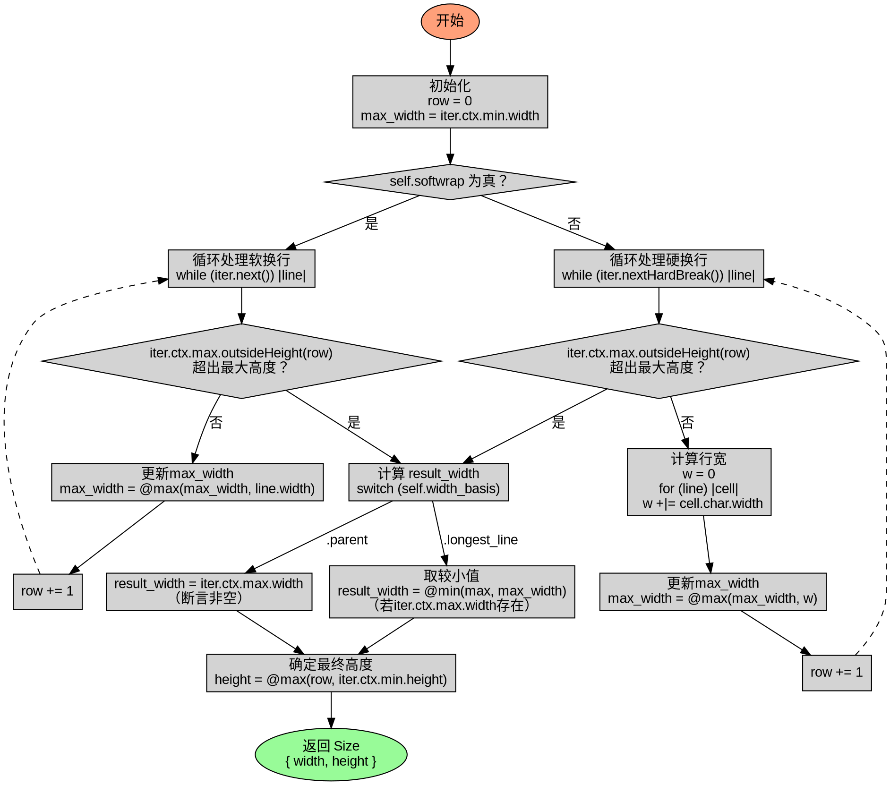

嗯，我需要为这个Zig函数`findContainerSize`生成Graphviz的流程图。首先，我得仔细理解这个函数的结构和逻辑流程。

函数开始于`defer iter.reset();`，这应该是在函数返回后重置迭代器。然后初始化`row`和`max_width`。接下来有两个主要的分支，根据`self.softwrap`的值来决定是进入软换行处理还是硬换行处理。

在软换行的情况下，使用`iter.next()`循环处理每一行，检查是否超出最大高度，然后更新`max_width`。每次循环后`row`递增。硬换行的情况类似，但使用的是`iter.nextHardBreak()`，并且需要计算每一行的宽度总和，使用`w +|= cell.char.width`，这可能是在累加每个字符的宽度，同时处理可能的溢出？

之后，处理`result_width`的确定，这里有一个switch语句，根据`self.width_basis`的不同情况来选择。如果是`.longest_line`，则取`max_width`和`iter.ctx.max.width`中的较小值，如果存在的话；如果是`.parent`，则直接使用`iter.ctx.max.width`，并且断言其不为空。

最后，返回一个包含计算后的宽度和高度的`Size`结构体，高度取`row`和`iter.ctx.min.height`的较大值。

接下来，我需要将这些步骤转化为流程图节点和判断分支。流程图应包括开始节点，初始化变量，判断`self.softwrap`的分支，两个循环处理块，处理`result_width`的switch分支，以及最终的返回节点。

需要注意的是，循环中的`defer row +=1`应该是在每次循环结束后执行，所以在流程图中可能需要将`row`的递增放在循环体的末尾。另外，`iter.ctx.max.outsideHeight(row)`的条件判断可能导致循环提前终止，所以每个循环中需要有一个判断节点。

在Graphviz中，使用节点和边来表示流程，菱形节点表示条件判断，矩形节点表示处理步骤。需要正确连接各个分支，特别是循环结构和条件判断的出口。

可能的结构如下：

开始 -> 初始化变量 -> 判断softwrap？是的话进入软换行循环，否则硬换行循环。每个循环内部处理行，更新max_width和row，直到满足退出条件。之后处理width_basis的选择，最后返回结果。

需要确保每个分支和循环都有正确的连接，避免遗漏可能的路径。例如，在软换行循环中，每次迭代都可能因为超出最大高度而退出循环，循环结束后继续执行后续的步骤。

可能还需要处理`result_width`计算中的两种情况，以及最终的返回值的组合。确保所有条件分支都被覆盖，并且流程图中的箭头正确反映代码的执行顺序。
================================================
