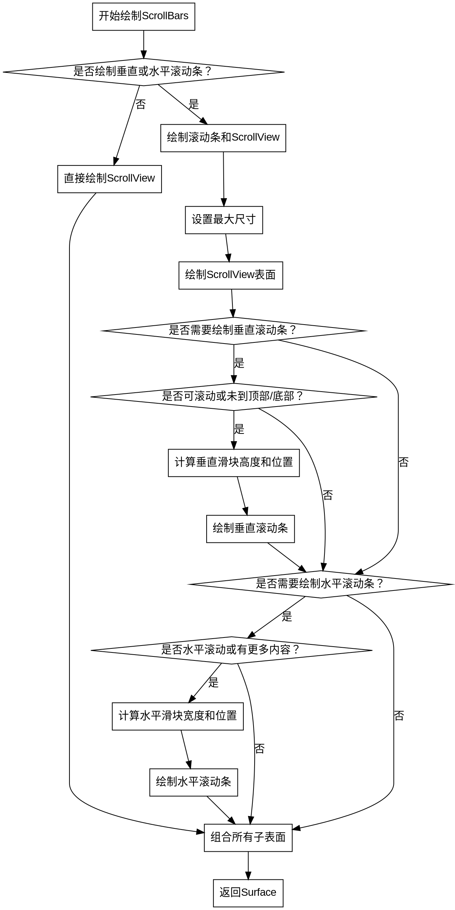

好的，我需要为这个Zig函数绘制一个流程图。首先，我需要仔细阅读代码，理解每个步骤的逻辑流程。

函数是draw，属于ScrollBars结构体。它接收一个DrawContext，并返回一个Surface或分配错误。函数的主要逻辑是处理滚动条的绘制，包括垂直和水平两种。

首先，函数检查是否需要绘制滚动条。如果不需要，就直接绘制ScrollView并返回。如果需要，则继续处理。

接下来，处理垂直滚动条。这里有很多条件判断，比如是否有更多的垂直内容，是否需要拖动或悬停时的不同样式。计算滑块的高度和位置，然后绘制。

然后是水平滚动条。同样需要判断是否有更多内容，计算滑块的宽度和位置，并进行绘制。

绘制完成后，将所有子表面（包括ScrollView和滚动条）组合起来返回。

现在需要将这些步骤转化为流程图。流程图应该包括开始、条件判断、处理步骤和结束。

可能的节点包括：

1. 开始
2. 判断是否绘制滚动条
3. 不绘制滚动条的情况：直接绘制ScrollView
4. 绘制滚动条的情况
5. 绘制垂直滚动条的条件和步骤
6. 绘制水平滚动条的条件和步骤
7. 组合子表面并返回

需要注意条件分支，比如是否需要绘制垂直或水平滚动条，以及各自的内部条件，比如是否可滚动、是否有更多内容等。

使用Graphviz的话，需要用节点和箭头表示流程，条件判断用菱形节点，处理步骤用矩形节点。

可能需要处理多个嵌套的条件，比如垂直滚动条的多个if语句，水平滚动条的判断是否有更多内容等。需要确保每个分支都正确连接。

最后，确保所有路径都汇聚到返回步骤。
================================================
