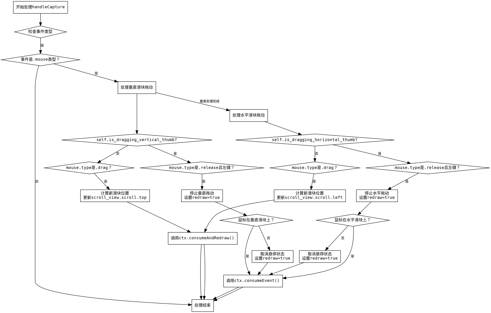

好的，我需要为提供的Zig代码生成一个Graphviz流程图。首先，我需要仔细阅读并理解这段代码的功能和结构。这段代码是处理滚动条的捕获事件，包括垂直和水平拖动操作。

首先，函数`handleCapture`接收一个事件，判断是否为鼠标事件。如果是鼠标事件，进一步检查是否正在拖动垂直或水平的滚动条滑块。对于垂直滑块，当鼠标释放时停止拖动，并根据鼠标位置更新状态，可能需要重绘。如果是拖动事件，则计算新的滑块位置并更新滚动视图的位置。水平滑块的处理逻辑类似。

接下来，我需要将这些逻辑步骤转化为流程图。流程图应该从函数入口开始，根据事件类型分支处理。每个条件判断（如是否是鼠标事件，是否是释放或拖动事件等）都需要相应的判断节点。处理垂直和水平滑块的部分需要分开，可能会有并行或分支结构。

需要注意的是，Graphviz使用DOT语言，所以我要确定各个节点之间的关系，正确使用条件判断和箭头连接。每个处理步骤应作为节点，条件判断作为菱形节点，不同的处理路径分开表示。

在绘制过程中，要确保垂直和水平滑块的处理不会混淆，流程清晰。同时，要处理事件后的消费（consumeEvent）和重绘（redraw）操作，这些步骤也需要体现在流程图中。

最后，检查流程图是否覆盖了所有可能的路径，包括事件类型不是鼠标的情况，以及各种条件下的处理是否正确连接。确保没有遗漏任何重要的步骤或条件，保证流程图的准确性和完整性。
================================================

该流程图展示了：
1. 从事件类型判断开始分支
2. 对垂直和水平滑块的拖动/释放处理采用并行结构
3. 使用菱形节点表示条件判断
4. 包含状态更新、重绘标记和事件消费等关键操作
5. 使用不同颜色区块区分垂直和水平滑块处理逻辑（实际渲染时需自行添加样式）
6. 严格遵循代码中的控制流顺序