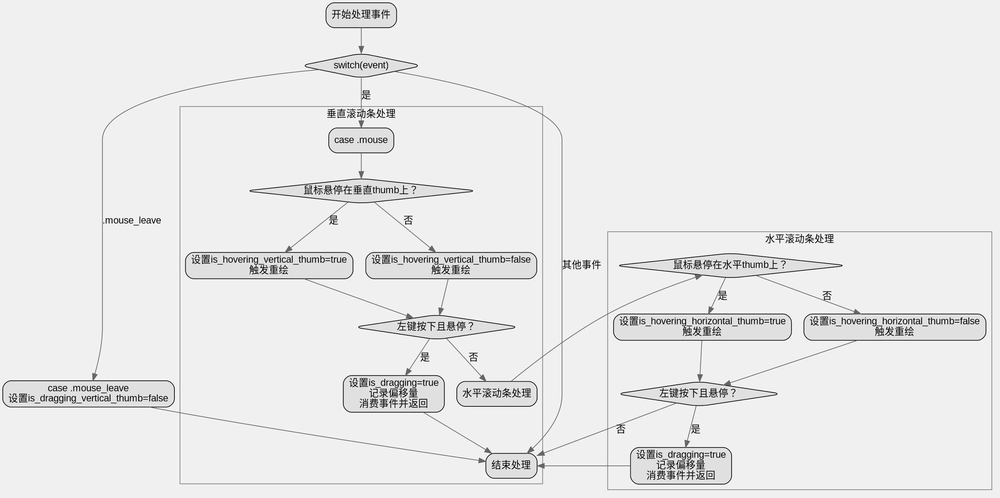

嗯，我需要根据提供的Zig代码来生成一个Graphviz的流程图。首先，我得仔细看一下这个函数的逻辑结构。函数handleEvent处理事件，主要是鼠标事件，分为垂直滚动条和水平滚动条的处理。

首先，函数开始于switch(event)，如果是鼠标事件，就会处理垂直滚动条的悬停和拖拽，然后是水平滚动条的类似处理。然后是mouse_leave事件的处理，将垂直拖拽状态设为false。其他事件则不做处理。

接下来，我需要将每个条件判断和状态转换转化为流程图的节点和边。比如，判断是否在垂直滚动条的thumb上，如果是，则更新hover状态并可能触发重绘。同样处理水平滚动条。还有处理拖拽开始的情况，设置相应的标志位并消费事件。

需要注意的是，每个条件分支可能有两个方向，比如if和else的情况。同时，当某些条件满足时，会设置redraw标志或者consume事件，这些动作也需要作为节点。

可能的结构是：

1. 开始节点：处理事件。
2. 判断事件类型是否为mouse，如果是，进入垂直滚动条处理。
   a. 检查是否悬停在垂直thumb上，更新状态并可能触发redraw。
   b. 检查是否开始拖拽垂直thumb，设置is_dragging和offset，并消费事件。
3. 接着处理水平滚动条的类似逻辑。
4. 如果是mouse_leave事件，设置is_dragging_vertical_thumb为false。
5. 其他事件则结束。

需要确保每个分支都有正确的连接，包括条件判断后的不同路径，以及可能的返回点（如消费事件后的返回）。

现在需要考虑如何将这些步骤转化为Graphviz的节点和边。使用条件判断作为菱形节点，操作为矩形节点。例如：

开始 -> 判断事件类型
如果是mouse事件，进入垂直thumb的悬停判断。
悬停判断条件：是或否，分别更新状态和redraw。
然后检查是否开始拖拽，如果是，设置变量并消费事件，返回。
否则继续处理水平滚动条的逻辑。
处理完水平滚动条后，结束。
如果是mouse_leave事件，设置dragging为false。
其他事件则直接结束。

需要注意流程中的返回点，比如在开始拖拽时消费事件后直接返回，不会继续执行后续的水平滚动条处理。这点在流程图中需要正确表示，可能需要在条件满足时直接指向结束节点。

可能的结构中，处理垂直拖拽后如果消费事件，流程结束。否则继续处理水平部分。类似地处理水平部分。

现在开始绘制Graphviz的节点和边，使用正确的标签和箭头方向。确保每个条件分支都有两个出口（yes/no），每个操作步骤有对应的节点，并且连接正确。
================================================
