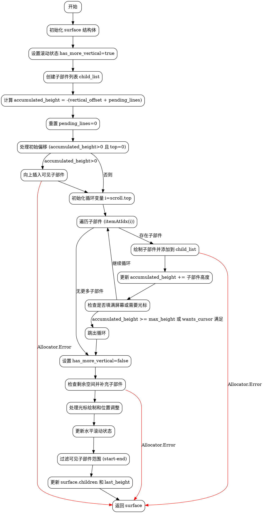

好的，我需要为给定的Zig函数绘制一个流程图。首先，我需要理解这个函数的结构和逻辑流程。函数名为drawBuilder，属于ScrollView结构体的方法，主要功能是绘制滚动视图的内容。

首先，函数开始时会设置一些初始状态，比如surface的初始化，处理滚动相关的变量如vertical_offset和pending_lines。然后，通过accumulated_height来跟踪已绘制内容的高度，处理滚动偏移。

接下来，函数处理子部件的插入，根据滚动位置调整accumulated_height，并遍历子部件进行绘制。这里有一个循环，逐个绘制子部件，直到填满可用空间或没有更多子部件为止。之后，处理光标的显示，调整子部件的位置以确保光标可见。

在处理完所有子部件后，函数还需要处理滚动到顶部或底部的情况，调整子部件的位置以正确显示。最后，更新水平滚动状态，确定可见的子部件范围，并设置最终的surface.children。

为了绘制流程图，我需要将这些步骤分解为不同的节点，并用箭头连接它们，表示控制流。需要注意条件判断和循环结构，如while循环和if-else分支。同时，需要处理错误情况，如Allocator.Error的可能抛出。

可能遇到的挑战是正确映射每个条件分支到流程图的决策节点，并确保循环结构正确表示。此外，需要确保所有可能的执行路径都被涵盖，特别是处理光标和滚动状态的复杂逻辑部分。

最后，生成Graphviz的DOT语言代码，使用适当的节点和边来表示整个函数的流程。
================================================
