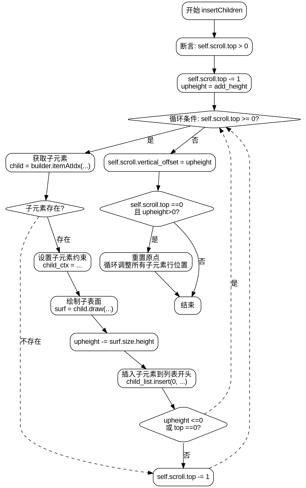

好的，我需要为给定的Zig函数`insertChildren`绘制流程图。首先，我需要仔细阅读并理解这段代码的功能和结构。

函数`insertChildren`的作用是向滚动视图插入子元素。看起来它处理滚动位置，计算子元素的高度，并将它们添加到子元素列表的开头。过程中还涉及一些条件判断，比如是否绘制光标，以及调整垂直偏移量。

首先，我会分解函数的步骤：

1. **断言检查**：确保`self.scroll.top > 0`。
2. **减少`self.scroll.top`**：初始减1。
3. **循环处理子元素**：从当前`self.scroll.top`开始向上遍历，直到顶部或满足某些条件。
4. **获取子元素**：通过`builder.itemAtIdx`获取当前索引的子元素。
5. **设置子元素的绘制上下文**：调整约束条件，考虑光标的偏移。
6. **绘制子元素表面**：调用`child.draw`生成表面。
7. **计算累积高度**：`upheight`减去当前表面的高度。
8. **插入子元素到列表开头**：调整列和行的偏移。
9. **循环终止条件**：检查`upheight`是否小于等于0或是否到达顶部。
10. **设置垂直偏移**：循环结束后，更新`self.scroll.vertical_offset`。
11. **处理顶部元素溢出情况**：如果顶部元素位置过低，重置原点并调整所有子元素的行位置。
12. **再次设置垂直偏移**：确保最终的`vertical_offset`正确。

接下来，我需要将这些步骤转化为流程图的结构。流程图的开始是函数入口，然后是各个步骤的判断和操作。需要注意循环结构和条件分支的正确表示。

可能的节点包括：
- 开始
- 断言检查
- 初始化变量（如减少scroll.top，设置upheight）
- 循环开始（条件检查）
- 获取子元素（可能失败则退出循环）
- 设置绘制约束
- 绘制子表面
- 更新upheight
- 插入子元素到列表
- 检查循环终止条件
- 处理顶部溢出情况
- 结束

需要特别注意循环的结构，使用`while`循环，条件为`self.scroll.top >= 0`，并且在每次迭代中减少`self.scroll.top`。循环内部有多个步骤，包括可能的提前退出（`break`）。

另外，处理顶部溢出的部分是在循环结束后进行的，需要判断`self.scroll.top`是否为0且`upheight > 0`，如果是，则调整所有子元素的行位置。

最后，两次设置`self.scroll.vertical_offset = upheight`，但可能在处理溢出后覆盖该值，需要确认流程是否正确。

在绘制流程图时，使用Graphviz的语法，正确表示各个步骤的顺序、条件分支和循环结构。确保节点之间的箭头正确反映控制流，例如循环的回流和条件分支的不同路径。
================================================
