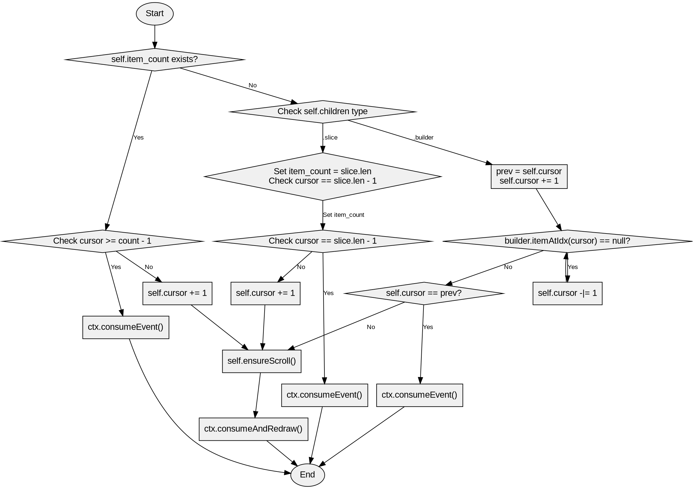

嗯，我现在需要理解这个用Zig编写的nextItem函数，并为它生成一个Graphviz的流程图。首先，我得仔细阅读代码，弄清楚它的逻辑结构。

函数名是nextItem，属于ScrollView结构体的方法。参数是self指针和一个事件上下文ctx。函数的主要功能似乎是处理滚动视图中的下一个项目。让我一步步分析。

首先，函数检查self.item_count是否存在（即是否为非null）。如果有item_count，那么当cursor大于等于count-1时，调用ctx.consumeEvent()并返回，否则cursor加1。这部分比较简单，处理的是已知项目数量的情况。

如果没有item_count，那就要根据self.children的类型来处理。children可以是.slice或.builder。对于.slice的情况，设置item_count为切片长度，然后检查cursor是否在末尾，如果是则consume事件，否则cursor加1。这里可能需要处理切片长度的转换，因为用到了@intCast。

对于.builder的情况，这里比较复杂。先保存当前的cursor到prev，然后cursor加1。接着进入一个循环，检查builder的itemAtIdx是否存在，如果不存在，cursor会递减（使用-|=操作符，可能是饱和减法，防止下溢）。循环直到找到存在的项目。如果cursor和prev相同，说明没有变化，consume事件，否则继续。

无论哪种情况，最后都会调用self.ensureScroll()，然后ctx.consumeAndRedraw()。

接下来，我需要把这些逻辑转换成流程图。流程图中的每个判断和操作都要用节点表示，并用箭头连接。

可能的流程节点包括：

1. 开始
2. 检查item_count是否存在
3. 处理item_count存在的情况：检查cursor是否>=count-1，是的话consumeEvent，否则cursor加1
4. 处理item_count不存在的情况：根据children的类型分支
5. 处理.slice的情况：设置item_count，检查cursor是否在末尾，是的话consume，否则cursor加1
6. 处理.builder的情况：保存prev，cursor加1，循环检查itemAtIdx是否存在，直到找到有效项，比较cursor和prev
7. 无论哪种情况，最后执行ensureScroll和consumeAndRedraw

需要注意条件分支的正确连接，比如在.slice和.builder后的不同路径。对于循环部分，builder的情况中的while循环需要表示为一个循环结构，但流程图可能需要用条件判断和回边来表现。

可能需要将builder的处理拆分成几个步骤：保存prev，增加cursor，进入循环，检查itemAtIdx，递减cursor，循环继续的条件是itemAtIdx返回null，否则退出循环，然后检查cursor是否等于prev。

另外，要注意流程中的合并点，比如处理完item_count存在或不存在的情况后，都会走到ensureScroll和redraw部分，除非某些条件直接返回了（如consumeEvent）。

现在需要考虑如何将这些步骤用Graphviz的节点和边表示出来。例如，使用菱形表示条件判断，矩形表示操作步骤，箭头表示流程方向。

可能的错误点：在条件判断的分支连接上是否正确，比如在builder处理中，循环的表示是否正确，以及各分支是否最终合并到正确的位置。

另外，需要确保在条件判断后的返回路径是否直接结束流程，还是继续到后续步骤。例如，在item_count存在的情况下，如果cursor >= count-1，则调用consumeEvent并返回，否则cursor加1，然后继续到ensureScroll。而其他情况中，如果满足某些条件（如cursor未改变），也会直接返回，否则继续。

总结，流程图的结构大致如下：

- 开始
- 检查是否有item_count
  - 是：检查cursor >= count-1 → 是→consumeEvent并返回
                          → 否→cursor加1→继续到ensureScroll
  - 否：检查children类型
    - .slice：设置item_count→检查cursor是否末尾→是→consumeEvent并返回
                                           →否→cursor加1→继续到ensureScroll
    - .builder：保存prev→cursor加1→进入循环→检查itemAtIdx是否存在
      →存在？→退出循环→检查cursor是否等于prev→是→consumeEvent并返回
                                            →否→继续到ensureScroll
      →不存在→cursor递减→继续循环
- ensureScroll→consumeAndRedraw→结束

需要将这些步骤用Graphviz正确表达，注意循环的处理可能需要条件判断节点，例如在builder的循环中，用条件判断itemAtIdx是否为null，如果是，则递减cursor并继续循环，否则退出循环。

可能还需要处理循环的流程，虽然Graphviz没有专门的循环结构，但可以通过条件节点和箭头连接来实现。例如，在builder处理中，循环部分可以表示为：

在cursor加1后，进入一个条件判断“itemAtIdx存在？”，如果不存在，则递减cursor，并回到该条件判断；如果存在，则继续后续步骤。

这样，流程图中的循环可以通过条件节点和回边来表示。

现在，我需要将上述逻辑转化为Graphviz的DOT语言代码，确保每个步骤正确连接，条件分支正确，返回点正确处理。
================================================

该流程图使用Graphviz的DOT语言绘制，完整展现了`nextItem`函数的逻辑流程：

1. **入口**从椭圆形的"Start"节点开始
2. 首先检查`self.item_count`是否存在（菱形决策节点）
3. 存在时：
   - 检查光标是否越界，越界则直接消费事件结束
   - 否则移动光标并继续流程
4. 不存在时：
   - 根据`self.children`类型分叉处理
   - `.slice`分支处理固定长度的边界检测
   - `.builder`分支通过循环探测有效项（用条件节点+回边实现循环逻辑）
5. 所有有效路径最终汇聚到`ensureScroll`和`consumeAndRedraw`操作
6. 流程终止于椭圆形的"End"节点

关键循环逻辑体现在`.builder`处理中：通过`check_item_exists`节点和`decrement_cursor`操作形成循环检测，直到找到有效item索引为止。