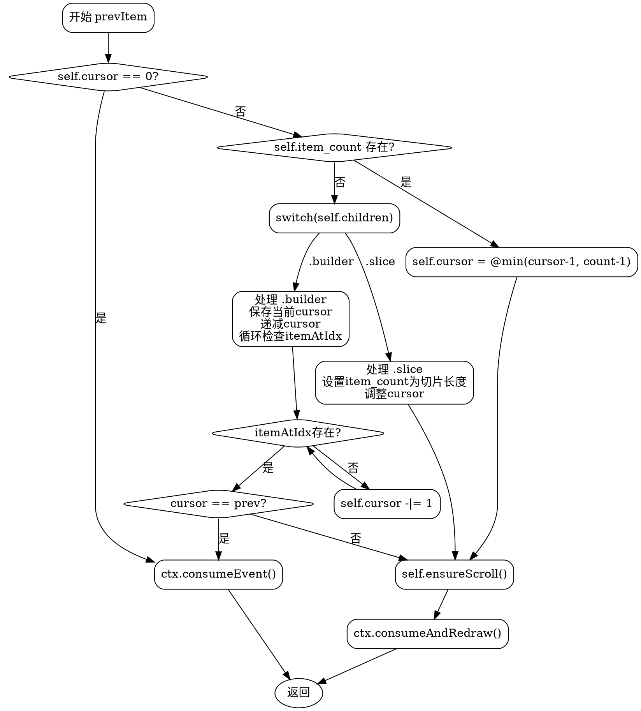

好的，我需要为给定的Zig函数`prevItem`生成一个Graphviz的流程图。首先，我需要理解这个函数的结构和逻辑。

函数开始检查`self.cursor`是否为0。如果是的话，调用`ctx.consumeEvent()`并返回。这应该是流程图的第一个判断节点。

接下来，函数检查`self.item_count`是否存在。如果存在（即`count`不为空），则将`self.cursor`减1，但不超过`count - 1`。这里可能需要一个分支，处理有`item_count`的情况。

如果`self.item_count`不存在，那么进入`switch (self.children)`。这里有两种情况：`.slice`和`.builder`。对于`.slice`，设置`item_count`为切片长度，并调整`cursor`。对于`.builder`，处理更复杂的情况：保存当前光标位置，递减光标，然后循环检查是否存在有效项，直到找到为止。如果光标没有变化，则调用`consumeEvent`并返回，否则继续。

最后，无论哪种情况，都会调用`self.ensureScroll()`，然后返回`consumeAndRedraw()`。

接下来，我需要将这些步骤转化为流程图节点和判断条件。需要注意各个分支的合并点，例如在`.builder`分支中，可能需要循环处理。同时，确保所有可能的路径都正确连接。

可能的节点包括：
1. 开始节点。
2. 检查cursor是否为0。
3. 检查item_count是否存在。
4. 处理item_count存在的分支。
5. 处理slice的情况。
6. 处理builder的情况，包括循环检查itemAtIdx。
7. 最终调用ensureScroll和返回consumeAndRedraw。

需要特别注意循环部分在流程图中的表示，可能需要使用判断节点和箭头回指。

确保所有条件分支正确连接，并且流程图的结束节点正确指向最后的步骤。
================================================


该流程图使用Graphviz的DOT语言表示，主要特点：
1. 菱形节点表示条件判断
2. 矩形节点表示操作步骤
3. 箭头上的标签说明条件判断结果
4. 包含了循环处理builder.itemAtIdx的逻辑
5. 所有路径最终汇聚到ensureScroll和consumeAndRedraw
6. 使用椭圆表示结束节点

可以通过Graphviz工具（如dot命令）渲染为PNG/SVG等格式：
```bash
dot -Tpng flowchart.dot -o prevItem_flowchart.png
```