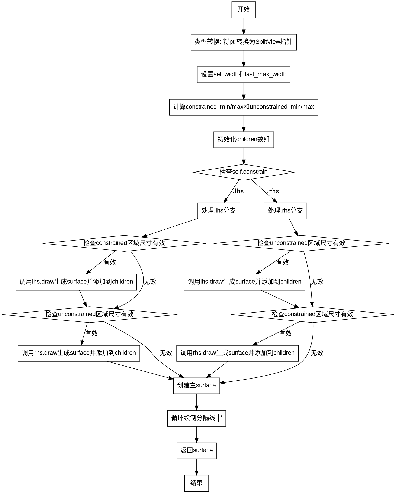

好的，我需要为给定的Zig函数绘制一个流程图。首先，我得仔细阅读代码，理解它的结构和逻辑流程。

函数名为typeErasedDrawFn，参数是一个指针和绘图上下文，返回一个Surface或错误。首先，代码将指针转换为SplitView类型。然后处理宽度约束，设置self.width和last_max_width。

接下来，定义了两个尺寸：constrained_min和unconstrained_min，分别对应左右或右左的约束区域。然后创建了一个子surface的数组，容量为2，因为SplitView有两个子部件。

然后根据self.constrain的值（.lhs或.rhs）分支处理。每个分支中，先处理被约束的部分（如lhs时处理左侧），再处理未约束的部分（右侧）。每个部分都通过draw方法生成surface，并添加到children数组中，同时指定它们的原点位置。

之后，使用initWithChildren创建主surface，并在中间绘制分隔线“│”每个行。最后返回这个surface。

接下来需要将这个过程转化为流程图。流程图通常包括开始、结束、判断、处理步骤等。

流程图的步骤可能如下：

1. 开始
2. 类型转换和初始化参数
3. 设置宽度约束
4. 计算constrained和unconstrained的尺寸
5. 初始化children数组
6. 根据constrain分支判断：lhs还是rhs
7. 对于每个分支，处理被约束和未约束的部分：
   a. 检查尺寸是否有效
   b. 调用draw生成surface
   c. 添加到children
8. 创建主surface
9. 绘制分隔线
10. 返回surface

需要注意判断条件，比如在lhs和rhs分支中，处理各自的约束部分时，需要检查宽度和高度是否大于0。这可能需要在流程图中用判断框表示。

可能还需要处理循环，例如在绘制分隔线时，循环每一行。这时候流程图里需要有循环结构，但graphviz中可能需要用节点和箭头表示循环。

需要确保流程图的每个步骤清晰，逻辑正确，没有遗漏关键判断和处理步骤。同时，注意graphviz的语法，正确使用节点、箭头、条件分支等。
================================================
