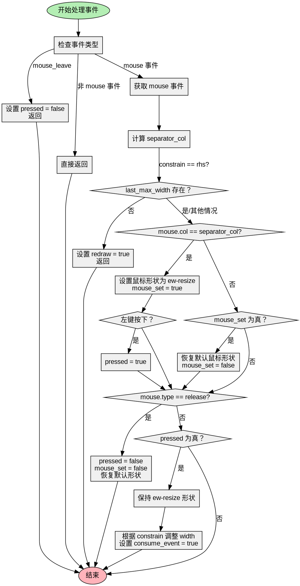

好的，我现在需要为给定的Zig函数生成一个Graphviz流程图。首先，我需要仔细理解这个函数的结构和逻辑。

函数名是typeErasedEventHandler，参数包括ptr、ctx和event。函数内部处理事件，主要是鼠标事件，用于调整SplitView的宽度。

首先，函数将ptr转换为SplitView指针。然后根据事件类型进行不同的处理：

1. 如果是mouse_leave事件，设置pressed为false并返回。
2. 如果是其他非mouse事件，直接返回。
3. 对于mouse事件，进一步处理。

接下来，根据self.constrain的值（lhs或rhs）计算separator_col。对于rhs情况，需要考虑last_max_width是否存在，否则触发重绘并返回。

然后检查鼠标位置是否在分隔符列上，设置鼠标形状为ew-resize，并处理左键按下事件，设置pressed为true。如果不在分隔符列但之前设置过鼠标形状，则恢复默认形状。

处理鼠标释放事件时，重置pressed和mouse_set，并恢复默认鼠标形状。

如果处于按下状态（pressed为true），保持鼠标形状，并根据constrain方向调整width，确保在min_width和max_width范围内。最后标记事件已被消费。

现在需要将这些逻辑步骤转化为流程图。流程图通常包括开始、结束节点，判断分支，处理步骤。

可能的步骤：

- 开始节点
- 检查事件类型，分为mouse_leave、mouse、其他事件
- 对于mouse事件，计算separator_col
- 检查鼠标位置是否在分隔符列
- 设置鼠标形状或恢复默认
- 处理鼠标按下和释放事件
- 如果处于按下状态，调整宽度并设置consume_event
- 结束节点

需要注意条件判断的分支，如事件类型、constrain类型、鼠标位置是否在分隔符列、是否按下等。

可能的结构：

开始 → 事件类型判断 → 不同处理 → 计算separator_col → 鼠标位置判断 → 设置鼠标形状 → 处理按下/释放 → 检查pressed → 调整宽度 → 结束

需要确保每个条件分支正确连接，避免遗漏可能的路径。

可能的问题点：处理rhs时last_max_width是否存在的判断，如果不存在则触发redraw并返回。这在流程图中需要体现为一个分支。

此外，在调整宽度时，根据constrain类型有不同的计算方式，这也需要分支表示。

最后，确保所有可能的路径都被覆盖，包括各种条件分支的true/false情况。
================================================
