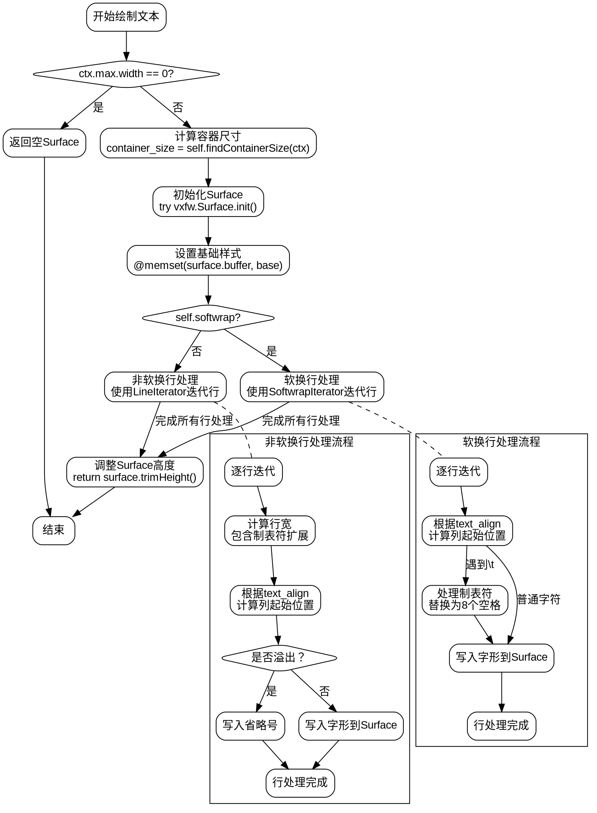

嗯，我现在需要帮用户用Graphviz画出这个Zig函数的流程图。首先，我得仔细看看这个函数的代码结构，理解它的逻辑流程。看起来这个函数是处理文本绘制的，分为软换行和非软换行两种情况，还可能处理制表符和对齐方式。

首先，函数开始检查ctx.max.width是否为0，如果是的话，就返回一个空的Surface。这一步应该对应流程图中的一个条件判断节点。接下来，计算容器大小，然后初始化Surface，设置基础样式。这部分是初始化步骤，可以作为一个处理块。

然后，根据self.softwrap的值分为两个主要分支：软换行和非软换行。软换行分支使用SoftwrapIterator迭代每一行，处理对齐，逐个字符处理，包括处理制表符（替换为8个空格）。而非软换行分支使用LineIterator，同样处理对齐，但这里还要处理溢出时的省略号情况。

每个分支内部都有循环处理每一行，行内处理每个字符，需要考虑不同的对齐方式（左对齐、居中、右对齐），以及可能的制表符扩展和溢出处理。这里可能需要多个循环和条件判断节点。

需要注意的是，在处理字符时，如果遇到制表符，会写入8个空格，这可能涉及到内部循环。对于溢出处理，当文本超过容器宽度时，可能会用省略号代替，这也是一个条件分支。

最后，返回调整高度的Surface，这里调用了trimHeight函数，并取row和ctx.min.height的最大值。

在画流程图时，需要将这些步骤分解为不同的节点，并用条件判断连接不同的分支。需要注意循环结构，比如while循环处理每一行，以及内部的字符处理循环。可能需要使用子图来表示循环结构，或者用节点间的箭头和标签来表示循环条件。

需要注意的是，Graphviz的语法使用节点和边，用条件判断来分支，循环可能需要用带有箭头的回边来表示。不过有时候为了简洁，可能不会详细画出循环的所有步骤，而是用注释说明循环的存在。

另外，函数的开始和结束节点要明确，每个主要处理步骤作为节点，条件判断作为菱形节点，分支不同的路径。初始化部分和最后的返回部分也要正确连接。

现在需要考虑如何组织这些步骤，确保逻辑正确，流程清晰。可能需要先画出主干流程，然后处理每个分支的细节，确保条件判断和循环正确表示。同时，注意避免过于复杂，保持流程图的可读性。
================================================
