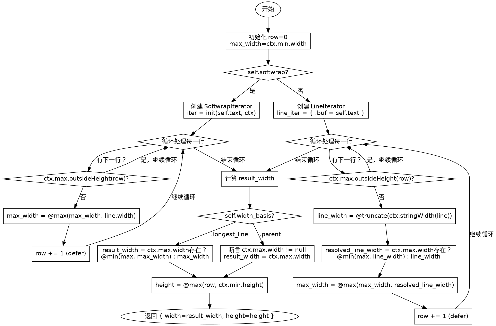

嗯，我需要为这个Zig函数画一个流程图。首先，我得仔细看看这个函数是做什么的。函数名为findContainerSize，返回一个vxfw.Size类型。看起来是计算文本容器的尺寸，考虑软换行、最大最小宽度高度等参数。

首先，函数开始声明了row和max_width变量。然后根据self.softwrap的值分为两个分支：一个是处理软换行的情况，另一个是不处理的情况。我需要理清这两个分支的逻辑流程。

在softwrap为true的情况下，使用SoftwrapIterator迭代每一行。每次循环检查是否超出最大高度，如果超出就break。然后defer row +=1，并更新max_width。这里的defer可能需要注意执行顺序，不过流程图里可能需要按顺序表示。

在softwrap为false的情况下，使用LineIterator，同样循环每一行。同样检查最大高度，计算每行的宽度line_width，然后根据ctx.max.width是否存在来决定使用最小值还是原值，再更新max_width。

之后，处理result_width，根据self.width_basis的不同情况：如果是longest_line，则取max_width和ctx.max.width中的较小值；如果是parent，则直接使用ctx.max.width，这里有一个断言确保ctx.max.width不为null。

最后返回的Size对象包含result_width和max(row, ctx.min.height)。

接下来，我需要将这些步骤转化为流程图。流程图应该从开始节点开始，然后分支判断self.softwrap是否为真。每个分支处理各自的循环和计算。然后合并到处理result_width的部分，再根据width_basis的情况分支，最后合并到返回结果。

需要注意循环结构、条件判断的正确表示，以及各个变量的更新步骤。可能需要用不同的图形表示判断节点、处理步骤、循环等。

另外，确保使用graphviz的正确语法，比如用diamond表示判断，矩形表示处理步骤，箭头连接流程。需要避免在graphviz中使用mermaid的语法，比如不要用-->，而应该用->，并且正确使用graphviz的结构。

可能还需要处理循环内的条件判断，比如在每次迭代时检查ctx.max.outsideHeight(row)，如果为真则break循环。这时候应该在流程图中体现循环的开始、条件判断、可能的退出和继续。

最后，确认各个步骤的顺序是否正确，特别是defer row +=1的位置，虽然在代码中是defer，但在流程图中应该按实际执行顺序处理，即先处理行内容，然后在循环结束后增加row，或者可能在每次循环结束时增加row？需要仔细看代码逻辑。比如在代码中，defer row +=1是在循环体内，所以每次循环结束后会执行，所以在流程图中应该在处理完该行后，增加row的值。

可能还需要处理max_width的更新，无论是softwrap分支还是非softwrap分支，都需要在每次循环中比较并更新max_width的值。

总之，流程图的步骤大致如下：

1. 开始
2. 初始化row=0，max_width=ctx.min.width
3. 判断self.softwrap是否为真
   - 是：使用SoftwrapIterator，循环处理每一行
     a. 检查是否超出最大高度，如果是则break循环
     b. 处理当前行，更新max_width
     c. defer row +=1（实际在循环体结束后执行）
   - 否：使用LineIterator，循环处理每一行
     a. 检查是否超出最大高度，如果是则break循环
     b. 计算line_width
     c. 根据ctx.max.width是否存在决定resolved_line_width
     d. 更新max_width
     e. defer row +=1
4. 循环结束后，处理result_width：
   - 根据width_basis分支：
     - longest_line：比较max_width和ctx.max.width，取较小值
     - parent：断言ctx.max.width存在，取ctx.max.width
5. 计算最终height为max(row, ctx.min.height)
6. 返回Size对象

在流程图中，需要将这些步骤转化为节点和判断，使用正确的连接线。可能需要使用子图来表示循环结构，或者用循环节点。但graphviz中通常用条件判断和箭头来表示循环。

比如，在softwrap的分支中，循环结构可以用一个判断节点“是否有下一行？”开始，然后处理该行，更新变量，再回到判断。但具体实现可能需要用多个节点和条件连接。

可能还需要处理两个分支后的共同部分，即处理result_width和返回结果。

现在，我需要将这些步骤转化为graphviz的DOT语言。注意节点和边的正确连接，以及条件判断的表示。
================================================

这个流程图完整展示了函数逻辑：
1. 初始化变量后根据`softwrap`进入不同分支
2. 两个分支分别用迭代器处理行内容并动态更新`max_width`
3. 循环结束后统一处理`width_basis`分支逻辑
4. 最终计算高度并返回结果。菱形节点表示条件判断，矩形节点表示操作步骤，椭圆形表示开始/结束。