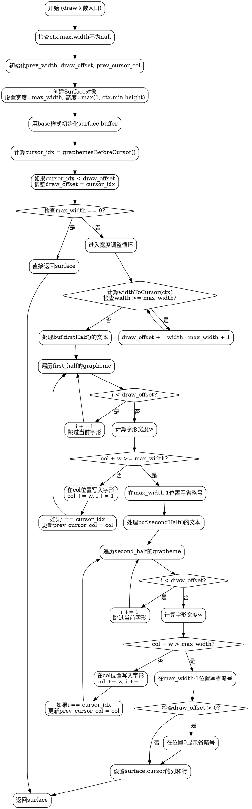

嗯，用户让我用Graphviz来画这个Zig函数的流程图。首先，我需要理解这个函数的结构和逻辑流程。函数是TextField的draw方法，看起来主要负责绘制文本字段的表面，处理光标位置和文本截断。

首先，函数开始处有一些断言和变量初始化。比如检查max_width是否为null，然后设置prev_width和draw_offset。接着创建一个Surface对象，设置其宽度和高度。然后处理光标的索引，调整draw_offset以确保光标在可视区域内。之后分两部分处理文本，前半部分和后半部分，使用graphemeIterator来遍历每个字形，计算宽度，处理超出最大宽度的情况，显示省略号。最后设置光标的位置并返回surface。

接下来，我需要将这些步骤转化为流程图中的节点和分支。可能的关键节点包括：

1. 开始节点：函数入口。
2. 断言和初始化max_width。
3. 创建surface对象。
4. 设置buffer的初始样式。
5. 处理光标索引和draw_offset的调整。
6. 循环处理前半部分和后半部分的文本。
7. 判断每个字形是否超出宽度，决定显示省略号还是继续。
8. 处理draw_offset大于0时显示前面的省略号。
9. 设置光标的列和行。
10. 返回surface。

需要注意循环结构，比如while (true)循环调整draw_offset，以及两个部分的迭代处理。每个条件判断（如if (col + w >= max_width)）都需要分支。

在Graphviz中，使用digraph，节点用矩形或菱形表示判断，箭头表示流程方向。可能需要将循环展开为条件判断和跳转。例如，处理前半部分和后半部分的迭代可以用两个循环结构表示，每个循环内有宽度检查和可能的省略号显示。

另外，错误处理部分，比如Allocator.Error，可能在创建surface时出现，但函数返回的是try，所以可能需要在流程图中体现错误返回的路径？不过用户可能更关注主流程，所以暂时忽略错误处理，或者用一个节点表示。

需要确保每个步骤都正确转换为节点，条件分支正确连接。例如，当max_width为0时直接返回surface，这是一个条件分支。

可能的结构：

开始 -> 断言max_width不为null -> 初始化prev_width等 -> 创建surface -> 设置buffer样式 -> 计算cursor_idx -> 调整draw_offset -> 进入循环处理前半部分 -> 每个字形处理 -> 检查宽度，显示省略号或继续 -> 处理后半部分类似 -> 检查draw_offset显示前面的省略号 -> 设置光标位置 -> 返回surface。

其中循环部分可能需要子图，但Graphviz处理循环通常用条件判断和箭头回指。比如，while循环调整draw_offset，可以用条件判断是否继续循环。

需要仔细检查代码中的每个条件，如if (cursor_idx < self.draw_offset) 调整draw_offset，以及后续的while循环处理width >= max_width的情况。

可能还需要处理两个半部分的迭代，每个迭代内部有循环处理每个字形，所以需要两个循环结构。

综上，流程图需要涵盖所有主要步骤和条件分支，确保逻辑正确。
================================================
