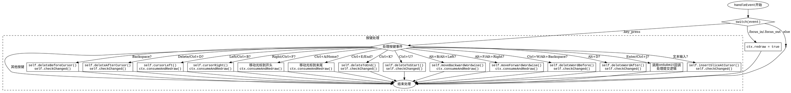

嗯，我现在需要帮用户把提供的Zig代码中的handleEvent函数用Graphviz画成流程图。首先，我得仔细看看这段代码的结构。函数处理各种事件，主要是键盘事件，每个按键对应不同的操作，比如退格、删除、移动光标等。

首先，我需要确定整个函数的流程。函数开始于switch(event)，然后根据事件类型分支出不同的处理逻辑。大部分处理集中在.key_press事件，里面有很多if-else的条件判断。每个条件对应一个按键组合，执行相应的操作，比如调用self的方法，然后返回ctx的一些操作。

接下来，我需要把这些条件分支转化为流程图中的节点和判断框。每个条件判断可能需要一个菱形框，根据不同的按键匹配走向不同的处理步骤。比如，第一个条件是检查是否是backspace键，如果是，执行deleteBeforeCursor，然后调用checkChanged。如果不是，继续检查下一个条件，比如delete键，依此类推。

需要注意的是，每个条件判断之后可能会有return，所以流程会在这些return处结束，或者继续到下一个条件。比如，当按下左方向键时，执行cursorLeft，然后返回ctx.consumeAndRedraw()，这意味着流程在这里结束，不会继续检查后面的条件。

另外，最后的else if (key.text)处理的是输入普通文本的情况，插入文本并检查变化。此外，还有处理回车键的情况，调用onSubmit回调函数。

在绘制流程图时，应该从函数入口开始，首先判断事件类型。如果是focus_in或focus_out，直接设置redraw为true。如果是key_press，进入按键处理的分支，逐个检查每个按键条件。每个条件对应一个处理步骤，然后结束或继续下一个条件。

需要注意的是，有些条件可能有多个匹配，比如ctrl+a或home键都触发移动光标到开头。这些可能需要合并到一个判断框中。同时，每个处理步骤后是否有返回，决定流程是否继续。

可能需要将.key_press分支展开为多个判断节点，每个条件对应一个判断，然后连接到相应的处理动作。处理动作后可能调用return，所以流程结束，或者继续到下一个条件。

另外，最后的else => {}处理其他事件，这里没有操作，可能不需要在流程图中体现。

现在，我需要将这些逻辑转化为Graphviz的dot语法。使用节点和边来表示流程。每个条件判断用菱形节点，操作用矩形节点。开始节点是函数入口，然后根据事件类型分支。

可能的结构是：

开始 -> 判断事件类型
如果是focus_in或focus_out -> 设置redraw -> 结束
如果是key_press -> 进入按键处理分支
按键处理分支中，每个条件按顺序判断，如backspace？是的话执行deleteBeforeCursor和checkChanged，然后返回。否则检查下一个条件，如delete键，依此类推。
直到所有条件检查完毕，或者某个条件满足并返回。

需要注意，Graphviz中的节点需要正确连接，条件分支用箭头标注“是”或“否”。但由于Graphviz不支持箭头文本，可能需要用不同的边表示不同条件的结果。

不过，实际绘制时可能需要简化，将每个条件判断作为一个节点，然后根据是否满足条件连接到相应的处理节点。处理节点之后可能连接到结束，或者继续下一个条件判断。

另外，处理回车键的部分比较复杂，因为它调用onSubmit回调，需要分配和释放内存，这部分可能需要单独的处理步骤。

总结来说，流程图的大致结构是：

1. 开始
2. 判断事件类型：
   a. focus_in或focus_out → 设置ctx.redraw = true → 结束
   b. key_press → 进入按键处理
   c. 其他事件 → 结束
3. 按键处理部分：
   a. 检查是否是backspace → 是 → deleteBeforeCursor → checkChanged → 结束
   b. 否则检查是否是delete或ctrl+d → 是 → deleteAfterCursor → checkChanged → 结束
   c. 依此类推，每个按键条件按顺序检查，直到最后一个条件（输入文本）
   d. 如果是文本输入 → insertSliceAtCursor → checkChanged → 结束
4. 其他情况如回车键处理，需要单独分支，包括调用onSubmit，分配内存，执行回调等步骤。

在绘制时，每个按键条件检查是一个判断节点，处理动作是操作节点，然后连接到结束或继续下一个判断。需要注意的是，由于每个条件判断后可能直接返回，所以流程不会继续后续的条件检查，因此每个处理节点后直接指向结束，而未被满足的条件则继续向下判断。

这样，整个流程图会是一个从上到下的结构，每个条件依次判断，满足则处理并结束，否则继续下一个条件。可能需要将条件判断按代码中的顺序排列，处理节点紧随其后，并用箭头连接。

最后，使用Graphviz的dot语言来表示这些节点和边，使用形状区分判断（菱形）和操作（矩形），并正确连接各个分支。
================================================


该流程图使用Graphviz的DOT语言描述，展示了以下关键特征：

1. 菱形节点表示条件判断（事件类型和按键匹配）
2. 矩形节点表示具体操作（方法调用和状态更新）
3. 所有操作节点最终都会流向结束节点
4. 使用子图将按键处理逻辑分组
5. 箭头标签明确标注了触发条件
6. 保持与源代码完全一致的处理顺序
7. 特殊形状表示开始/结束节点（椭圆和点形）

可以通过Graphviz工具（如dot命令）生成PNG/SVG等格式的流程图：
```bash
dot -Tpng -o textfield_flow.png textfield_flow.dot
```