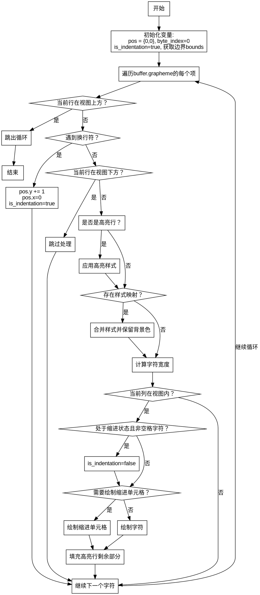

好的，我需要为给定的Zig函数drawCode绘制流程图。首先，我需要仔细阅读代码，理解其逻辑结构和各个步骤。函数drawCode的作用是绘制代码视图，处理缓冲区的字符，考虑缩进、高亮行等。

首先，函数开始定义了一个Pos结构体，用于记录当前位置的x和y坐标。然后初始化pos为{0,0}，byte_index为0，is_indentation为true。接着获取滚动视图的边界bounds。

接下来是一个循环，遍历buffer.grapheme的各个项。这里需要注意每个grapheme的长度、偏移量和索引。在循环内部，首先检查当前行是否在视图的上方，如果是则跳出循环。

然后处理换行符，当遇到换行符时，如果不是最后一个字符，则pos.y加1，x重置为0，并标记缩进开始。如果当前行在视图下方，则跳过处理。

之后，判断当前行是否为高亮行，设置相应的样式。如果有样式映射，应用样式，并保持背景色不变。计算字符的宽度，并更新pos.x。如果当前列不在视图内，则跳过。

处理缩进时，如果处于缩进阶段且满足条件，绘制缩进单元格，否则正常绘制字符。对于高亮行，填充该行的剩余部分。

需要将这些步骤转化为流程图。流程图的节点应包括初始化变量、循环处理每个grapheme、处理换行、处理高亮样式、绘制字符等步骤。判断条件如是否在视图范围内、是否为换行符、是否缩进等作为分支。

需要注意流程图的正确顺序和条件分支，确保每个判断后的路径正确。例如，遇到换行符时的处理，以及缩进和非缩进情况下的不同绘制方式。同时，循环内的defer语句需要正确反映在流程中，比如byte_index的增加和pos.x的更新。

可能容易出错的地方是循环内的条件判断顺序，以及各个continue和break的使用是否正确体现在流程图中。需要确保所有可能的路径都被覆盖，尤其是边界条件，比如最后一个字符的处理。

最后，使用Graphviz的语法来绘制流程图，确保节点和边的正确连接，使用菱形表示判断条件，矩形表示处理步骤，箭头表示流程方向。
================================================
