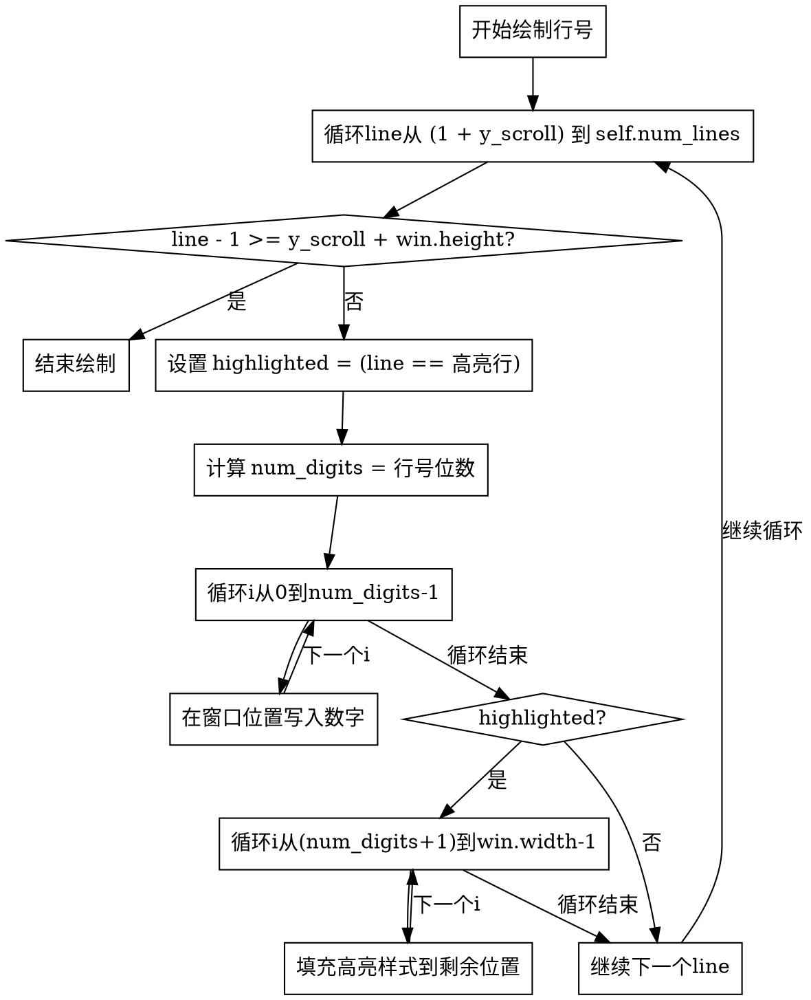

嗯，用户让我用Graphviz来画这个Zig函数的流程图。首先，我需要理解这段代码的结构和逻辑。函数是draw，属于LineNumbers组件，接收self、win和y_scroll参数。看起来是在窗口中绘制行号，可能用于编辑器之类的应用。

首先，函数有一个循环，从1 + y_scroll到self.num_lines。这里要注意循环变量是line。循环内部首先检查是否line -1 >= y_scroll + win.height，如果是的话就break。这说明当行号超过窗口可视区域时停止绘制，避免渲染不必要的行。

接下来，判断当前行是否高亮，即highlighted变量。然后计算行号的数字位数num_digits。这里可能需要numDigits和extractDigit这两个辅助函数，但用户没给出代码，所以暂时假设它们的功能是获取行号的位数和每一位的数字。

然后，内部有一个循环，从0到num_digits，处理每一位数字。使用win.writeCell来绘制每个数字的位置，x坐标是win.width减去i+2，y坐标是line减去y_scroll+1。这里可能有计算错误，比如坐标转换是否正确，但流程图不需要处理这个，只需要逻辑结构。

如果当前行高亮，还会在数字后面填充空格，用另一个循环从num_digits +1到win.width，设置样式。

现在需要将这些逻辑转化为流程图。流程图通常包括开始、结束、条件判断、循环、处理步骤等。每个步骤需要分解成节点，并用箭头连接。

可能的步骤：

1. 开始draw函数。
2. 进入循环：遍历line从1 + y_scroll到self.num_lines。
3. 判断line -1是否超过y_scroll + win.height，是则break。
4. 设置highlighted变量。
5. 计算num_digits。
6. 循环处理每个数字位，绘制到窗口。
7. 判断是否highlighted，如果是，填充剩余宽度。
8. 循环结束，继续下一个line。
9. 循环结束后结束函数。

需要注意循环的嵌套结构。外层循环是line的循环，内层有两个循环：绘制数字和填充高亮区域。条件判断在循环内部。

另外，Graphviz的语法需要用节点和边来表示流程，可能需要使用子图来处理循环结构。但Graphviz的子图处理可能比较复杂，可以简化成顺序结构，用条件判断节点和循环节点来表示。

可能的节点：

- 开始节点
- 循环line开始
- 判断是否超出窗口高度，是则跳出循环
- 设置highlighted
- 计算num_digits
- 循环处理每个数字位
- 判断是否highlighted，是则进入填充循环
- 填充循环处理每个位置
- 循环结束，继续下一个line
- 结束函数

需要注意箭头方向，条件判断的分支（是/否）如何处理。例如，当判断line是否超出时，是的话break，否则继续处理该line。

可能遇到的难点是正确表示循环的嵌套结构，尤其是内层循环和条件判断。需要确保每个步骤的逻辑顺序正确，并且循环和条件的分支清晰。

另外，用户强调不要用mermaid，所以必须使用Graphviz的dot语法。需要确保生成的代码符合Graphviz的结构，比如使用digraph，节点用形状（如矩形、菱形表示判断），边用箭头连接。

可能需要多次调整节点和边的结构，确保流程图准确反映代码的执行流程。
================================================

生成流程图的步骤解释：

1. **开始**：进入绘制流程
2. **行号循环**：遍历所有需要显示的行号
3. **行溢出检查**：判断当前行是否超出可视范围
4. **设置高亮标志**：判断当前行是否需要高亮显示
5. **计算位数**：确定行号的字符位数（如123是3位）
6. **数字循环**：逐位绘制每个数字字符
7. **高亮判断**：决定是否需要填充右侧空白区域
8. **填充循环**：对高亮行的剩余位置应用样式
9. **循环控制**：继续处理下一个行号或结束

各节点使用标准Graphviz形状：
- 普通操作：矩形
- 条件判断：菱形
- 箭头标注条件分支（是/否）
- 循环结构通过节点间的回指箭头表示