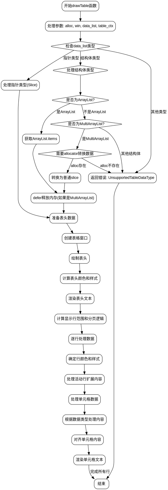

好的，我需要根据提供的Zig代码中的drawTable函数，用Graphviz生成一个流程图。首先，我得理解这个函数的结构和流程，然后将其分解为不同的步骤和决策点。

首先，函数开始于参数处理，包括alloc、win、data_list和table_ctx。接下来，处理data_list以确定其类型，可能是Slice、ArrayList或MultiArrayList。这里有几个条件分支，比如检查类型是否为指针、结构体，并进一步判断是否为ArrayList或MultiArrayList。如果是MultiArrayList且alloc存在，则进行数据转换，否则返回错误。

然后，函数处理表头，根据不同的配置（如字段名或自定义表头）生成headers。接下来创建表格窗口，并根据列宽和样式绘制表头。这里涉及到颜色、边框和对齐方式的处理。

绘制行数据时，需要计算每行的起始位置和最大显示项数。处理活动行（被选中的行）和分页逻辑，确定显示的起始和结束索引。对于每一行，根据是否为活动行或选中行应用不同的颜色，然后逐个单元格处理数据。每个单元格的内容根据类型处理，比如字符串、枚举、可选类型等，并使用allocator处理非字符串类型或截断过长的文本。

在绘制每个单元格时，需要考虑列的对齐方式（左对齐或居中），并应用相应的样式。最后，将所有内容渲染到窗口上。

接下来，我需要将这些步骤转化为Graphviz的节点和边。每个主要步骤作为一个节点，条件判断作为分支节点。例如，处理data_list的类型判断、生成headers、绘制表头、处理行数据的分页逻辑、绘制每个单元格等步骤。

需要注意函数中的错误处理和defer语句，比如在释放内存时的defer语句。此外，循环结构如for循环需要表示为子流程，可能在流程图中用循环节点表示。

需要确保流程图中的箭头正确表示控制流的方向，条件分支用菱形节点表示，处理不同的情况。例如，判断data_list类型是否为指针、结构体，是否是ArrayList或MultiArrayList等。

最后，检查所有可能的路径，包括错误返回的情况，确保流程图完整覆盖函数的执行流程。
================================================
