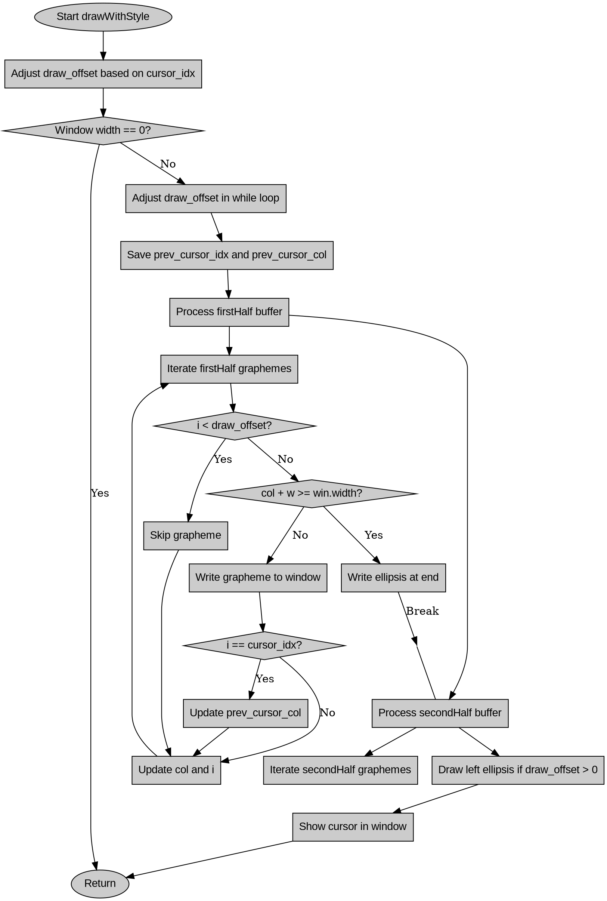

好的，我现在要帮用户分析这个用Zig编写的drawWithStyle函数，并生成对应的流程图。首先，我需要理解这个函数的功能和结构。

函数名为drawWithStyle，属于TextInput结构体的方法。参数包括一个Window对象和一个Cell.Style样式。主要功能应该是在窗口中绘制文本输入框，并根据光标位置调整显示内容，可能包括处理文本溢出、显示省略号以及光标位置的计算。

首先，函数开始部分处理draw_offset的调整。cursor_idx通过graphemesBeforeCursor()获取，如果cursor_idx小于当前的draw_offset，就将draw_offset设为cursor_idx。这可能是在确保光标在可见区域内的操作。接着，如果窗口宽度为0，直接返回，因为没有空间可绘制。

然后进入一个while循环，不断调整draw_offset，直到widthToCursor的结果小于窗口宽度。这里可能是在计算文本的显示区域，当文本宽度超过窗口宽度时，需要调整偏移量，确保光标所在位置可见。+|=操作符可能用于增加draw_offset的值，直到满足条件。

接下来，保存当前光标的位置到prev_cursor_idx和prev_cursor_col，用于后续的光标显示。

然后分为两部分处理缓冲区：firstHalf和secondHalf。可能是文本缓冲区被分成两部分，比如前半部分和后半部分，处理时需要分别迭代。使用graphemeIterator来遍历每个字素（grapheme），这可能处理Unicode字符，特别是组合字符如表情符号或带有变音符号的字母。

在遍历每个字素时，首先检查是否需要跳过draw_offset之前的字素。然后计算字素的宽度，如果超过窗口宽度，就在窗口末尾显示省略号。否则，将字素写入窗口的相应位置，并更新列位置col。同时，当遇到光标位置时，记录prev_cursor_col。

处理完两部分缓冲区后，如果draw_offset大于0，说明左侧有被截断的文本，因此在窗口最左侧显示省略号。最后，调用showCursor显示光标的位置。

接下来需要将这些逻辑步骤转化为流程图。流程图应该包括开始、结束、条件判断、循环、处理步骤等节点。需要注意循环结构，如while循环，以及条件分支，比如宽度是否超过窗口宽度，是否到达光标位置等。

可能的流程图结构如下：

1. 开始节点：函数开始。
2. 调整draw_offset：根据cursor_idx和初始条件调整。
3. 检查窗口宽度是否为0，若是则结束。
4. 进入while循环调整draw_offset，直到文本宽度适合窗口。
5. 保存光标位置。
6. 处理前半部分缓冲区：
   a. 遍历每个字素。
   b. 跳过draw_offset之前的字素。
   c. 检查宽度是否超过窗口，显示省略号并跳出循环。
   d. 写入字素，更新列位置，记录光标位置。
7. 处理后半部分缓冲区，类似前半部分。
8. 如果draw_offset>0，显示左侧省略号。
9. 显示光标位置。
10. 结束节点。

需要注意的是，处理前半和后半部分的结构类似，可能可以合并为一个子流程，但根据代码结构，它们是分开处理的。同时，循环中的continue和break需要正确表示。

此外，需要处理可能的边缘情况，例如文本刚好填满窗口，或者光标在最后位置等。但流程图主要反映代码的结构，不需要涉及具体数据值。

最后，确保使用Graphviz的语法，正确使用节点、边、条件判断的菱形符号等，避免使用Mermaid语法。
================================================

该流程图使用Graphviz绘制，主要步骤如下：  
1. **初始调整**：根据光标位置调整`draw_offset`  
2. **检查窗口宽度**：若为0则直接返回  
3. **循环调整偏移**：确保文本宽度不超过窗口  
4. **处理前后半缓冲区**：遍历字素，处理截断并绘制内容  
5. **绘制左侧省略号**：若存在偏移则显示  
6. **显示光标**：最终更新光标位置  

节点形状说明：  
- 椭圆：开始/结束  
- 菱形：条件判断  
- 矩形：处理步骤  
- 虚线箭头：隐含流程跳转（如循环结束）