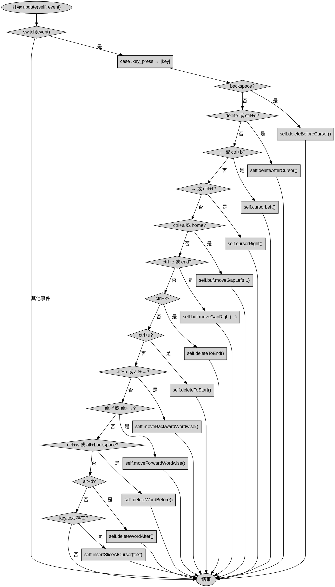

嗯，我需要帮用户用Graphviz画一个函数`update`的流程图。这个函数是用Zig写的，处理各种键盘事件。首先，我得理解这个函数的结构。函数里有一个switch语句，处理不同的event，这里event是.key_press的情况。然后根据不同的按键匹配，执行不同的方法，比如backspace、delete、左右方向键等等，还有处理文本输入。

首先，流程图应该从函数入口开始，然后判断事件类型是否是key_press。如果是，就进入按键处理的分支。每个条件判断对应不同的按键组合，比如按backspace执行deleteBeforeCursor，按左方向键或ctrl+b执行cursorLeft等等。最后，如果按键有text内容，就插入文本。

我需要把这些条件判断用Graphviz的节点和边表示出来。注意每个条件判断可能有多个条件，比如用if-else链，每个条件对应一个分支。可能需要将每个条件判断分解成节点，然后根据判断结果连接到对应的操作节点，最后汇总或者结束。

需要注意的是，Graphviz的语法使用节点和箭头来表示流程。可能需要使用菱形节点表示判断条件，矩形节点表示操作步骤。例如：

开始 -> 判断是否是key_press事件
如果是，进入第一个按键判断：是否匹配backspace？
是的话执行deleteBeforeCursor，否则进入下一个判断：是否匹配delete或ctrl+d？
依此类推，直到最后的else if处理text的情况。

另外，用户提到不要用Mermaid，所以必须确保生成的是正确的Graphviz代码。需要检查每个条件的分支是否正确，是否有遗漏的情况，比如最后的text处理。

可能的结构是，从上到下，每个条件判断依次排列，每个判断后连接到对应的操作，然后继续下一个判断。或者，可能更复杂，因为每个条件之间是互斥的，一旦满足某个条件，后面的就不再判断。所以流程图应该反映出这种逻辑结构，即每个条件检查后，如果满足就执行对应的操作并结束该事件处理，否则继续下一个条件。

可能需要将整个流程分解为多个节点，每个条件判断作为一个决策节点，然后根据结果分支到相应的操作节点，最后结束流程。需要确保所有的分支都被正确覆盖，没有遗漏。

另外，需要注意Graphviz的语法正确性，比如节点定义、边的方向、标签等。例如，使用->表示流程方向，节点用形状区分判断和操作。
================================================
