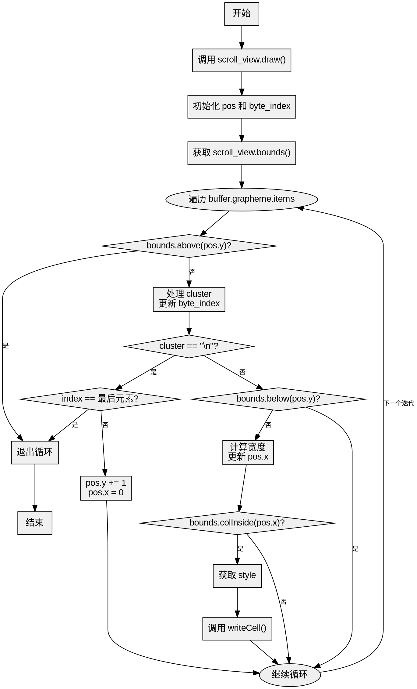

好的，我需要帮用户用Graphviz画出他们提供的Zig函数的流程图。首先，我得仔细理解这个函数的逻辑结构。

函数名为draw，参数是self指针、win和buffer。首先，调用了self.scroll_view.draw方法，传入win和一个包含buffer的cols和rows的结构。接着定义了一个Pos结构体，包含x和y的usize，初始化为0。然后声明了byte_index初始化为0。获取scroll_view的bounds。

接下来是一个循环，遍历buffer.grapheme的items，每个元素有len和offset，以及索引index。在循环内部，首先检查当前pos.y是否在bounds的上方，如果是就break退出循环。然后获取cluster，即buffer.content的切片，根据g_offset和g_len。之后byte_index增加cluster的长度。

然后处理换行符的情况：如果cluster是"\n"，并且是最后一个元素，就break；否则pos.y加1，x重置为0。如果pos.y在bounds下方，就继续循环。计算cluster的宽度，更新pos.x。如果当前x不在bounds的列范围内，继续循环。

接着处理样式：从buffer.style_map获取byte_index对应的style_index，如果存在则取对应的style，否则用默认样式。最后调用scroll_view.writeCell方法，写入单元格的信息。

现在，我需要将这些逻辑步骤转化为流程图。流程图通常包括开始、结束、处理步骤、条件判断和循环。需要注意循环的结构，比如for循环中的各个步骤，以及内部的if条件。

可能的流程步骤：
1. 开始
2. 调用scroll_view.draw
3. 初始化pos和byte_index
4. 获取bounds
5. 进入循环（遍历grapheme）
6. 检查bounds.above(pos.y) → 是则break
7. 处理cluster，更新byte_index
8. 检查是否是换行符 → 处理换行
9. 检查bounds.below(pos.y) → 是则继续循环
10. 计算宽度，更新pos.x
11. 检查bounds.colInside(pos.x) → 否则继续
12. 获取style
13. 调用writeCell
14. 循环结束
15. 结束

需要注意各个条件分支的连接，比如在循环内部的条件判断可能导致继续循环或执行其他操作。另外，循环的继续和break的情况需要正确表示。

在Graphviz中，使用节点表示步骤，箭头表示流程，条件判断使用菱形节点，分支用箭头标注条件。例如，循环开始后，检查bounds.above，如果是，则跳出循环到结束；否则继续处理cluster，然后处理换行符的情况等。

需要确保所有的条件分支都被正确覆盖，并且流程图的路径与代码逻辑一致。可能需要拆分复杂的条件，确保每个判断点都有两个出口（是/否）。例如，处理换行符时有两个条件：是否是换行符，以及是否是最后一个元素。这可能需要两个判断节点。

最后，将各个步骤用Graphviz的语法表示出来，注意节点和边的正确连接。
================================================
