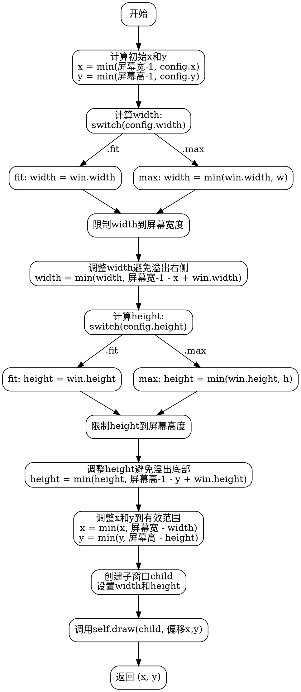

好的，我现在需要帮用户分析这个Zig函数，并生成Graphviz的流程图。首先，我得仔细阅读代码，理解每个步骤的作用。

函数名为`toWin`，参数是`self`指针、`win`窗口和`config`配置。返回一个包含两个u16的结构体。看起来这个函数的作用是调整窗口的位置和大小，确保它在屏幕范围内，然后绘制子窗口。

首先，代码里初始化x和y，取config中的x和y，但不超过屏幕的宽高减1。接下来处理width，这里有一个switch语句，根据config.width的类型（fit或max）来决定宽度。如果是fit，就用win的宽度；如果是max，取win.width和给定值w中的较小者。然后进一步将width限制在屏幕宽度内，再考虑x的位置，确保不超出屏幕右边界。这里用了`-|`操作符，可能是饱和减法，防止负数。

同样的逻辑处理height，得到最终的height值。然后调整x和y，确保窗口的宽度和高度不会让它们超出屏幕范围。接着创建子窗口child，使用计算后的width和height。调用self.draw方法，传入child和偏移量x、y。最后返回x和y的坐标。

接下来要画流程图。流程图的节点应该包括各个步骤：初始化x和y，计算width和height，调整x和y，创建child，绘制，返回结果。每个判断点比如switch语句需要分支。需要注意的是，Graphviz使用节点和边来表示流程，而mermaid可能语法不同，用户特别指出不要用mermaid。

可能的节点：
1. 开始
2. 计算初始x和y
3. 计算width的分支（fit或max）
4. 计算width的后续限制
5. 计算height的分支
6. 计算height的后续限制
7. 调整x和y以确保不超出屏幕
8. 创建子窗口child
9. 调用draw方法
10. 返回结果

需要确定各步骤之间的连接顺序，以及条件分支。例如，处理width时，switch的两个情况需要不同的路径。但根据代码，switch的结果直接赋值给width变量，然后继续处理，可能不需要独立的分支节点，而是作为处理过程中的条件判断。

可能需要将width和height的处理分解为子流程。例如，计算width的部分可以拆分为三个步骤：判断config.width类型，限制宽度到屏幕宽度，再限制到屏幕右边界。同样的逻辑适用于height。

在Graphviz中，可以用不同的节点形状表示不同步骤，如菱形表示判断，矩形表示操作。但用户没有特别要求形状，所以可能保持矩形即可，用标签说明步骤。

需要注意的是，代码中的`break :width ...`是Zig的标签断点，用于跳出块并返回值，这在流程图中可能对应一个计算步骤。

最后，将所有步骤按顺序连接，确保逻辑正确。例如，计算width和height是独立的，可以并行处理，但代码中是顺序执行，先width后height。因此流程图应反映这个顺序。

可能的错误点：是否在计算width和height时正确处理了边界条件，比如饱和减法。但在流程图中，这些细节可能不需要特别标注，除非用户有要求。

现在，根据以上分析，开始绘制Graphviz的流程图。
================================================
