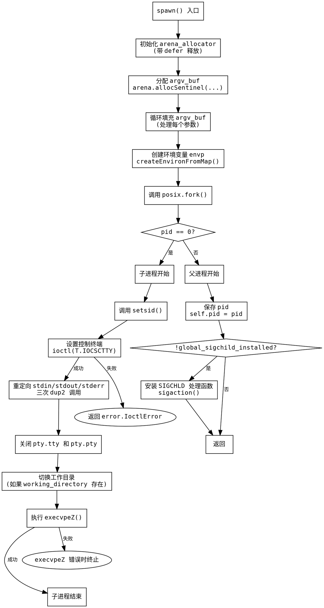

嗯，用户让我用Graphviz画一个Zig函数的流程图，而且不能错用Mermaid。首先，我需要理解这个函数的结构。函数名是spawn，属于Command结构体的方法。它接受一个指向自身的指针和一个分配器，返回一个错误联合的void。

首先，函数开始处创建了一个ArenaAllocator，并在之后用defer释放。这部分应该对应流程图的初始步骤，比如初始化分配器，分配内存。然后，它用arena分配了argv_buf，并填充参数。接着调用createEnvironFromMap创建环境变量envp。

接下来是关键部分：调用posix.fork()创建子进程。根据pid是否为0，分为子进程和父进程两个分支。子进程部分做了很多设置，比如setsid、设置控制终端、重定向标准输入输出错误、关闭文件描述符、改变工作目录，最后执行execvpeZ。如果这些步骤中任何一步出错，应该处理错误。

父进程部分则保存子进程的pid，然后检查是否安装了SIGCHLD信号处理。如果没有，就设置信号处理函数handleSigChild。这部分需要判断条件，然后执行相应的动作。

流程图应该从函数入口开始，按顺序画出各个步骤，包括条件判断（如fork后的分支）、循环（如填充argv_buf的for循环），以及错误处理。需要注意的是，Zig中的try关键字会提前返回错误，所以需要将这些可能出错的操作用判断框表示，错误路径指向错误处理或返回。

可能忽略的细节是错误处理流程，比如在创建argv_buf或envp时如果出错，函数会直接返回错误。此外，子进程中的posix调用可能失败，但代码中似乎没有处理这些错误，只是返回error.IoctlError，其他可能直接终止子进程。

需要确认各个步骤之间的连接是否正确，特别是fork后的两个分支，子进程执行完后应该结束，父进程继续执行后续步骤。信号处理的安装部分也是一个条件判断，需要判断Terminal.global_sigchild_installed是否为假。

最后，整个函数的结束是返回void，所以流程图的终点应该在父进程处理完信号后返回。
================================================

该流程图使用 Graphviz DOT 语言描述，主要特点：

1. 用菱形表示条件判断（fork结果和信号处理安装检查）
2. 绿色箭头表示正常流程路径
3. 红色箭头表示错误路径（如ioctl失败和exec失败）
4. 包含关键系统调用（setsid/dup2/execvpeZ等）的标注
5. 子进程和父进程分支明确分离
6. 使用等宽字体保持代码对齐风格
7. 用invis样式处理错误终止的隐式流程

可以通过Graphviz工具（如dot命令或在线渲染器）生成PNG/SVG等格式的流程图。